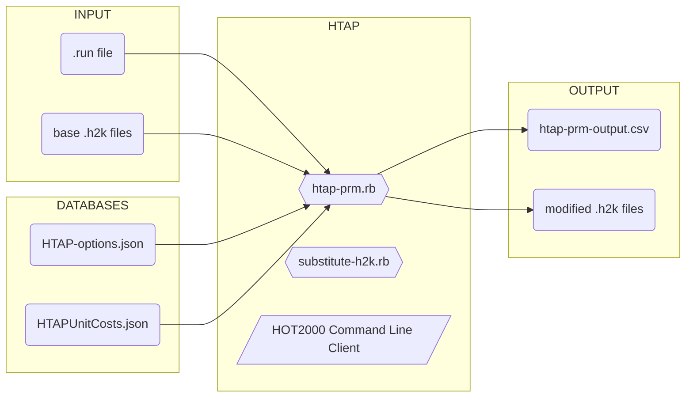
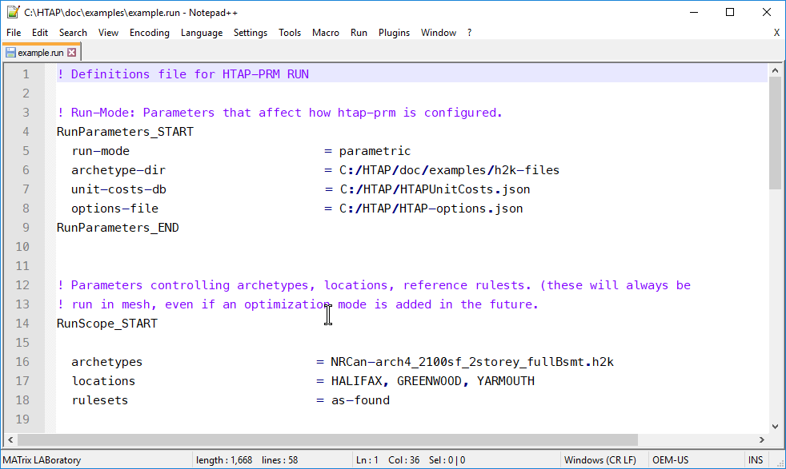
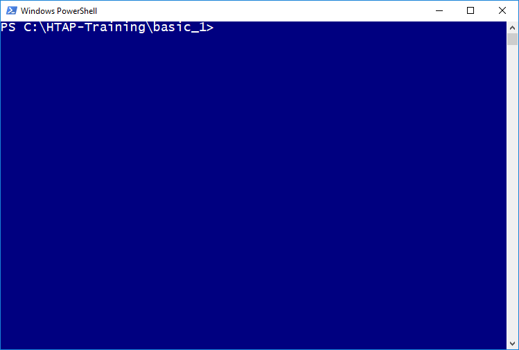
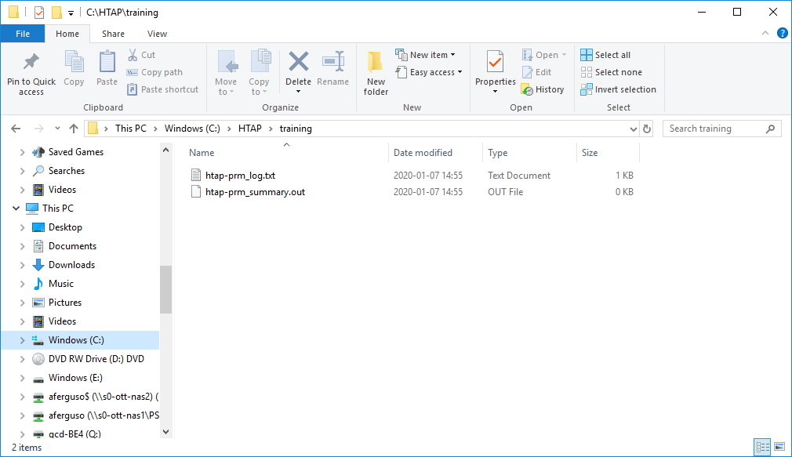
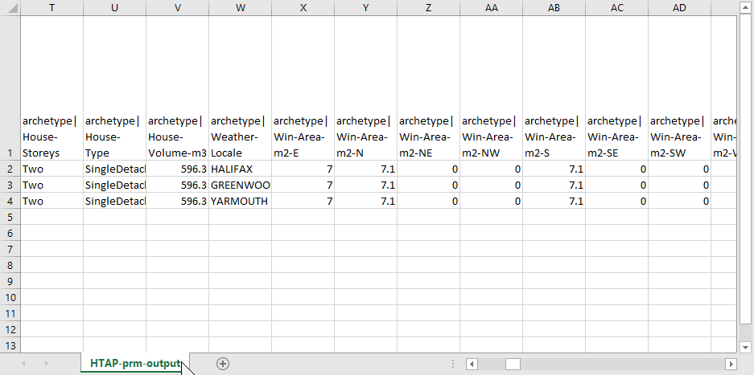
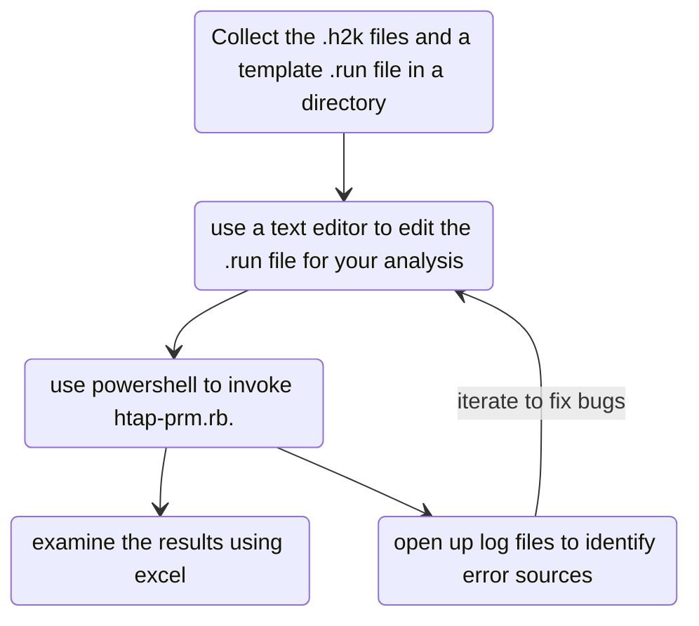

# HTAP TRAINING 

*_A training syllabus for  the Housing Technology Assessment Platform_*

## Prerequisites: Installing HTAP & Training materials

To follow this training curriculum, you must first have HTAP installed. This curriculum also requires additional materials to access them.

**Step 1:** Install HTAP:

Visit https://github.com/NRCan-IETS-CE-O-HBC/HTAP/blob/general-dev/doc/HTAP-installation.md, and follow the instructions there. 

**Step 2:** Download the training repository:

Using PowerShell, navigate to `C:\` and enter the command `git clone https://github.com/NRCan-IETS-CE-O-HBC/HTAP-Training.git`

```powershell
PS C:\Users> cd: C:\
PS C:\> git clone https://github.com/NRCan-IETS-CE-O-HBC/HTAP-Training.git
Cloning into 'HTAP-Training'...
remote: Enumerating objects: 4, done.
remote: Counting objects: 100% (4/4), done.
remote: Compressing objects: 100% (4/4), done.
remote: Total 4 (delta 0), reused 0 (delta 0), pack-reused 0
Unpacking objects: 100% (4/4), done.
PS C:\>
```


## Preface: Overview of HTAP ##

### Concept ###

HTAP is a batch scripting tool for HOT2000. It is designed to automate many of the tasks HOT2000 users manually perform through the user interface, such as changing wall insulation levels and furnace efficiencies. HTAP can also take advantage of parallel computing power, making hundreds or thousands of simulations possible. 

HTAP includes databases for for energy conservation measures and construction costs. These features enable HTAP explore different scenarios for more energy-efficient design.

### Things HTAP Can & Can't do:  ###

| HTAP CAN:                                                    | HTAP CAN'T:                                                  |
| ------------------------------------------------------------ | ------------------------------------------------------------ |
| Edit site, insulation, air sealing, window, HVAC & PV parameters in hot2000 file | Change administrative inputs (such as builder name)Create a new .h2k file from scratch |
| Perform operations across many .h2k files                    | Create a new .h2k file from scratch                          |
| Run thousands of different scenarios                         | Design a home                                                |
| Estimate upgrade costs for energy efficient housing          | Estimate utility costs[^1]                                   |
| Generate .csv and .json output for use in other tools        | Issue NRCan labels                                           |

[^1]: Future versions of HTAP will include utility price  forecast databases.

### HTAP Components ###

###### INPUTS - Parameters supplied or changed by the users ######

-  The `.run` file defines the run parameters - such as which upgrades should be applied and which locations should be studied
-  The base `.h2k` files are provided by the HTAP user, who has previously created them using HOT2000

###### HTAP Scripts and libraries functional components that make the tool up  ######

-  `HTAP-prm.rb` is the HTAP Parallel run manager. This is HTAP's highest-level script that manages runs. 
-  `substitute-h2k.rb` is a lower-level script that can manipulate HOT2000 files, invoke the HOT2000 command-line executable, and recover results.
-  The **HOT2000 Command Line Interface**  is a special version of HOT2000 that has no user interface and can be run via the command line.

###### DATABASES  ######

-  `HTAP-options.json` defines all the components within a HOT2000 model that HTAP knows how to manipulate, and options that they can be changed to
-  `HTAPUnitCosts.json` is a database of upgrade costs that HTAP uses to estimate capital cost impacts associated with changing a model

### HTAP Schematic ###



### HTAP Documentation ###

-  [HTAP-installation.md](https://github.com/NRCan-IETS-CE-O-HBC/HTAP/blob/general-dev/doc/HTAP-installation.md): brief document explaining how to install HTAP components and dependencies
-  [HTAP-quick-start.md](https://github.com/NRCan-IETS-CE-O-HBC/HTAP/blob/general-dev/doc/HTAP-quick-start.md): step-by-step guide for first-time users
-  [HTAP-input-and-output.md](https://github.com/NRCan-IETS-CE-O-HBC/HTAP/blob/general-dev/doc/HTAP-input-and-output.md): Comprehensive documentation on HTAP input files 

### HTAP User Tools ###

-  **Notepad++**: A text editor for editing HTAP files 
    

-  **Powershell**: A command line client for invoking HTAP scripts

-  **Windows Explorer**: File manager used to copy files for use in HTAP

-  **Spreadsheet**: Analysis tool used to examine HTAP's tabular output [^Alternate Tools]

     


[^Alternate Tools]: other analysis tools are very effective at analyzing HTAP output from very large sets.  - notes to be added. 


### A Typical HTAP session ###




## Module 1: Basic HTAP Operations  ##

Concepts introduced in this module:

-  Running HTAP from the command line
-  Editing run parameters
-  Troubleshooting errors 
-  Working with HTAP output 
-  Other command-line options

### Activity 1 — Running HTAP from the command line   ###

This activity will familiarize you with HTAP's command-line interface and output files. ==The files for this activity are located in `HTAP-Training\Basic_1`== 


>  **Task 1a:** Invoke HTAP's help message


**STEP 1:** Using PowerShell, navigate to the module folder using the command `cd C:\HTAP-Training\Basic_1\`. Output:

   ```
   PS C:\Users> cd C:\HTAP-Training\Basic_1\
   PS C:\HTAP-Training>
   ```


**STEP 2:** Invoke HTAP's help dialog using the command `C:\HTAP\htap-prm.rb -h`

```
PS C:\HTAP-Training\Basic_2> C:\HTAP\htap-prm.rb -h
Usage: htap-prm [options]
 USAGE: htap-prm.rb -o path\to\htap-options.json -r path\to\runfile.run -v

 Required inputs:
    -o, --options FILE               Specified options file.
    -r, --run-def FILE               Specified run definitions file (.run)

 Configuration options:
    -t, --threads X                  Number of threads to use
        --compute-costs              Estimate costs for assemblies using costing database.
    -c, --confirm                    Prompt before proceeding with run. After estimating the size
                                     and duration of the run, HTAP will ask for conformation before.
                                     coninuing.
    -e, --extra-output               Report additional data on archetype and part-load characteristics
    -k, --keep-all-files             Preserve all files, including modified .h2k files, in HTAP-sim-X
                                     directories. (otherwise, only files that generate errors will be
                                     saved).
    -j, --json                       Provide output in JSON format (htap-prm-output.json),
                                     in additon to .csv.
    -l, --LEEP-Pathways              Export tables for use in LEEP pathways tool
                                     output. Slows HTAP down, and make json output unwieldy on
                                     large runs.
    -a, --include_audit_data         Include detailed audit data for costing calculations in .json
                                     output. Slows HTAP down, and make json output unwieldy on
                                     large runs.
        --resume                     Attempt to resume prior interrupted run (experimental)
    -v, --verbose                    Output progress to console.

 Debugging options:
        --stop-on-error              Terminate run upon first error encountered.

    -h, --help                       Show help message

PS C:\HTAP-Training\Basic_2>
```


>  **TASK 1b:** Invoke HTAP for an already-configured run & examine outputs.


**STEP 1:**  Type `dir` to view the directory contents. You should find a single `.run` file inside: 

   ```
   PS C:\HTAP-Training\Basic_1> dir
   
   
       Directory: C:\HTAP-Training\Basic_1
   
   
   Mode                LastWriteTime         Length Name
   ----                -------------         ------ ----
   -a----       2020-01-07     15:33           1512 example.run
   
   ```

​      

**STEP 2:** Invoke HTAP with the command `C:\HTAP\htap-prm.rb -r .\example.run -c`, and answer `y` when prompted if you wish to continue.  HTAP's console output should look like the following:

   ```
   PS C:\HTAP-Training\Basic_1> C:\HTAP\htap-prm.rb -r .\example.run -c
   
   __________________________________________________________________________________
   = htap-prm: A simple parallel run manager for HTAP ===============================
   
    GitHub source:
       - Branch:   general-dev
       - Revision: 051c685
   
    Initialization:
       - Reading HTAP run definition from .\example.run...  done.
       - Evaluating combinations for parametric run
   
             * 3           { # of options for Location }
             * 1           { # of options for Archetypes }
             * 1           { # of options for Rulesets }
             *   (    1          { base option for all choices }
                  )
             ----------------------------------------------------------
              3               Total combinations
   
       - Creating parametric run for 3 combinations --- 3 combos created.
       - Guesstimated time requirements ~ 59 seconds (including pre- & post-processing)
   
       ? Continue with run ? [yes] y
   
   <<<<<<< SNIP >>>>>>>>
   
    - HTAP-prm: Run complete -----------------------
       + 3 files were evaluated successfully.
       + 0 files failed to run
   
   __________________________________________________________________________________
   = htap-prm: Run Summary ==========================================================
   
    Total processing time: 49.18 seconds
    -> Informational messages:
      (-) Info - Parsed options file C:/HTAP/HTAP-options.json
   
    -> Warning messages:
      (nil)
   
    -> Error messages:
      (nil)
   
    STATUS: Task completed successfully
   ==================================================================================
      
   PS C:\HTAP-Training\Basic_1>
   ```

   

**STEP 3.** Type `dir` to view the directory contents. You will find that HTAP has created a number of output files:

   ``` 
   PS C:\HTAP-Training\Basic_1> dir
   
   
       Directory: C:\HTAP-Training\Basic_1
   
   
   Mode                LastWriteTime         Length Name
   ----                -------------         ------ ----
   -a----       2020-01-07     15:33           1512 example.run
   -a----       2020-01-08     10:27              0 HTAP-prm-failures.txt
   -a----       2020-01-08     10:27           7477 HTAP-prm-output.csv
   -a----       2020-01-08     10:27              0 HTAP-prm-output.json
   -a----       2020-01-08     10:27             81 HTAP-prm.resume
   -a----       2020-01-08     10:27            431 htap-prm_log.txt
   -a----       2020-01-08     10:27            128 htap-prm_summary.out
   
   
   ```

   

   HTAP output files, in order of decreasing usefulness: 

| Filename:&nbsp;&nbsp;&nbsp;&nbsp;&nbsp;&nbsp;&nbsp;&nbsp;&nbsp;&nbsp;&nbsp;&nbsp;&nbsp;&nbsp;&nbsp;&nbsp;&nbsp;&nbsp;&nbsp;&nbsp;&nbsp;&nbsp;&nbsp;&nbsp;&nbsp;&nbsp;&nbsp;&nbsp;&nbsp;&nbsp; | Contents:                                                    | Used&nbsp;for:&nbsp;&nbsp;&nbsp;&nbsp;&nbsp;&nbsp;&nbsp;&nbsp;&nbsp;&nbsp;&nbsp;&nbsp;&nbsp;&nbsp; |
| ------------------------------------------------------------ | ------------------------------------------------------------ | ------------------------------------------------------------ |
| `HTAP-prm-output.csv`                                        | Results of HTAP run in tabular format. Formatted as comma- separated values. | Importing into spreadsheet or other analysis program         |
| `HTAP-prm-output.json`                                       | Results of HTAP run in structured data format. Formatted as nested hash. Includes warning, error and status messages, and more comprehensive data output than `.csv` results. This file is empty unless `htap-rpm.rb` is invoked with the `--json` option. | Importing into visualization software, application development |
| `HTAP-prm-failures.txt`                                      | List of files that failed to run.                            | Identifying problematic runs that need attention.            |
| `HTAP-prm.resume`                                            | Internal configuration file. Enables HTAP to resume a previously interrupted run. | Picking up where HTAP left off when your run crashed or stopped. |
| `htap-prm_log.txt`                                           | Messages describing HTAP's progress.                         | Developing HTAP                                              |
| `htap-prm_summary.out`                                       | Empty file currently generated by a bug in HTAP              | Nothing                                                      |

   

### Activity 2 — Editing run configuration ###

In this activity, you will begin working with HTAP configuration files and learn how to configure HTAP runs. ==The files for this activity  are located in `HTAP-Training\Basic_2`and in `HTAP-Training\h2k_files`== 


>  **TASK 2a:** Configure HTAP to run a different HOT2000 file in a different location.
>
>  HOT2000 files: 
>
>  -  `2Story-2100sqft-WalkOut.h2k`
>  
>  Locations: 
>
>  - Kamloops
>


**STEP 1:** Edit `example.run` using notepad++ 

-  Change the `archetypes` entry to reflect these .h2k files
-  Change the `locations` entry to include Vancouver and Kamloops

```
RunScope_START

  archetypes    =  2Story-2100sqft-WalkOut.h2k
  locations     = VANCOUVER, KAMLOOPS
  rulesets      = as-found

RunScope_END
```

-  Save the `.run` file. 


**STEP 2:** Run HTAP:

-  Invoke HTAP with the command `C:\HTAP\htap-prm.rb -r .\example.run -c`


**STEP 3:** Inspect the output.  

-  Open `HTAP-prm-output.csv` in a spreadsheet program
-  Inspect the following columns: 
   -  *archetype|h2k-file (~ column AY)*  - describes the h2k file used in each run
   -  *input|Opt-Location (~ column DE)* - describes the location where the HOT2000 simulation was run
   -  *output|\** - (~columns DS-FB) - describes HOT2000 data for each run


**QUESTION:**  

-  What happens if we misspell an entry in the run file — say `CAMLOOPS` ? 

   

>  **TASK 2b:** Configure HTAP to run the same analysis for two additional air-tightness specifications: 
>
>  -  ACH = 1.5 
>  -  ACH = 0.6


**STEP 1:** Locate the `OPT-ACH` entry in the run file:

```
Opt-ACH  = NA 
```

==NOTE:== The `NA` keyword instructs HTAP to leave the air-tightness specification unchanged. To change the air tightness specification, we need the corresponding keywords.


**STEP 2:** Open up the `HTAP-options.json` file in Notepad++, and locate the corresponding keywords

-  Open `C:\HTAP\HTAP-options.json`

-  Select *View: Fold-All*

-  Navigate to `"Opt-ACH"`: `"options"`, and locate appropriate keywords ( `New-Const-air_seal_to_1.50_ach`, `New-Const-air_seal_to_0.60_ach`)


**STEP 3:** Copy these keywords into your run file:

```
Opt-ACH = NA, New-Const-air_seal_to_1.50_ach, New-Const-air_seal_to_0.60_ach
```

Run HTAP and inspect results. Note field *input|ListOfUpgrades*

| archetype\h2k-File | input\Opt-Location | input\House-ListOfUpgrades | output\Energy-Total-GJ |
| -------- | -------- | -------- | -------- |
| 2Story-2100sqft-WalkOut.h2k | KAMLOOPS | - | 83 |
| 2Story-2100sqft-WalkOut.h2k | KAMLOOPS | Opt-ACH=>New-Const-air_seal_to_1.50_ach; | 78.2 |
| 2Story-2100sqft-WalkOut.h2k | KAMLOOPS | Opt-ACH=>New-Const-air_seal_to_0.60_ach; | 74.4 |


>  **TASK 2c:** Configure HTAP to include two different window specifications in the same analysis
>
>  -  Window A: U = 1.65, SHGC = 0.51
>  -  Window B: U = 1.65, SHGC = 0.19


**STEP 1:** Locate the `OPT-Windows` entry in the run file:

```
Opt-Windows     = NA
```


**STEP 2:** Browse the `HTAP-options.json` file and locate the relevant keywords from the `OPT-Windows` section (`NC-2g-HG-u1.65`,`NC-2g-LG-u1.65` )


**STEP 3:** Copy these keywords into the run file: 

```
Opt-Windows     = NA, NC-2g-HG-u1.65, NC-2g-LG-u1.65 
```

Run HTAP and inspect results. Note field *input|ListOfUpgrades*:


| archetype\h2k-File | input\Opt-Location | input\House-ListOfUpgrades | output\Energy-Total-GJ |
| -------- | -------- | -------- | -------- |
| 2Story-2100sqft-WalkOut.h2k | KAMLOOPS | - | 83 |
| 2Story-2100sqft-WalkOut.h2k | KAMLOOPS | Opt-ACH=>New-Const-air_seal_to_1.50_ach; | 78.2 |
| 2Story-2100sqft-WalkOut.h2k | KAMLOOPS | Opt-ACH=>New-Const-air_seal_to_0.60_ach; | 74.4 |
| 2Story-2100sqft-WalkOut.h2k | KAMLOOPS | Opt-Windows=>NC-2g-HG-u1.65; | 81.1 |
| 2Story-2100sqft-WalkOut.h2k | KAMLOOPS | Opt-Windows=>NC-2g-LG-u1.65; | 90 |

**QUESTION**

-  How many runs did we expect HTAP to complete?


>  **TASK 2d:** Configure HTAP to run every possible combination of window specification and air tightness
>
>  -  Window A: U = 1.65, SHGC = 0.51
>  -  Window B: U = 1.65, SHGC = 0.19
>  -  ACH = 1.5 
>  -  ACH = 0.6


**STEP 1:** Locate the run mode entry in the .run file

```
RunParameters_START
  run-mode                           = parametric
  archetype-dir                      = C:/HTAP-Training/h2k_files
  unit-costs-db                      = C:/HTAP/HTAPUnitCosts.json
  options-file                       = C:/HTAP/HTAP-options.json
RunParameters_END
```

==NOTE:== HTAP currently supports three different run modes: 

-  **parametric:** Runs every combination of archetype, location and ruleset. For each of those combinations, exercises each upgrade individually. 
-  **mesh:** Runs every combination of archetype, location, ruleset, and upgrade
-  **sample:** Randomly samples a specified number of runs from a the mesh solution space. 


**STEP 2:** Change the run mode to `mesh`

```
run-mode = mesh
```

Run HTAP and inspect results. Note field *input|ListOfUpgrades*:

| archetype\h2k-File | input\Opt-Location | input\House-ListOfUpgrades | output\Energy-Total-GJ |
| -------- | -------- | -------- | -------- |
| 2Story-2100sqft-WalkOut.h2k | KAMLOOPS | - | 83 |
| 2Story-2100sqft-WalkOut.h2k | KAMLOOPS | OptWindows=>NC-2g-HG-u1.65; | 81.1 |
| 2Story-2100sqft-WalkOut.h2k | KAMLOOPS | OptWindows=>NC-2g-LG-u1.65; | 90 |
| 2Story-2100sqft-WalkOut.h2k | KAMLOOPS | Opt-ACH=>New-Const-air_seal_to_1.50_ach; | 78.2 |
| 2Story-2100sqft-WalkOut.h2k | KAMLOOPS | Opt-ACH=>New-Const-air_seal_to_1.50_ach;  OptWindows=>NC-2g-HG-u1.65; | 76.4 |
| 2Story-2100sqft-WalkOut.h2k | KAMLOOPS | Opt-ACH=>New-Const-air_seal_to_1.50_ach;  OptWindows=>NC-2g-LG-u1.65; | 84.9 |
| 2Story-2100sqft-WalkOut.h2k | KAMLOOPS | Opt-ACH=>New-Const-air_seal_to_0.60_ach; | 74.4 |
| 2Story-2100sqft-WalkOut.h2k | KAMLOOPS | Opt-ACH=>New-Const-air_seal_to_0.60_ach; OptWindows=>NC-2g-HG-u1.65; | 72.5 |
| 2Story-2100sqft-WalkOut.h2k | KAMLOOPS | Opt-ACH=>New-Const-air_seal_to_0.60_ach; Opt_Windows=>NC-2g-LG-u1.65; | 80.9 |


### Activity 3 — Typical HTAP analysis runs ###

This activity will familiarize you with some common HTAP analysis tasks.  ==The files for this activity  are located in `HTAP-Training\Basic_3`and in `HTAP-Training\h2k_files`==

>  **Task 3a:** Estimate the energy savings associated with upgrading the windows and adding ceiling insulation in a four-unit row-house. 
>
>  197-203 Presland is a 70-year-old row-housing unit managed by Ottawa Community Housing. All four units are due for window replacement, and the property manager also wonders if she should add more insulation to the attic. 
>
>  
>
>  You have four hot2000 files corresponding to each of the units: `197-Presland.h2k`, `199-Presland.h2k`, `201-Presland.h2k`, `203-Presland.h2k`
>
>   Estimate the energy savings that can be achieved with the following options: 
>
>  -  Attic insulation upgraded to R30, R40, R50 effective
>  -  Windows upgraded to: mid-gain double pane (U=1.65), mid-gain triple pane (U=1.36), mid-gain very high performance (U=1.08)


**STEP 1:** Edit the `.run` file to include all of the archetypes: 

```
archetypes = 197-Presland.h2k, 199-Presland.h2k, 201-Presland.h2k, 203-Presland.h2k
```

==**TIP:**== HTAP supports wildcard inputs in the `.run` file. For instance, `archetypes = *Presland.h2k` would instruct HTAP to run all HOT2000 files with names containing the text "Presland.h2k". Setting `locations = *` causes HTAP to run the analysis in all locations supported by HOT2000.


**STEP 2:** Edit the `.run` file to that the location is set to Ottawa 

```
  locations   = OTTAWA
```


**STEP 3:** Edit the upgrades section to include the desired attic and window specifications. 

Browse the `HTAP-options.json`, and pick relevant options for `Opt-Windows` and `Opt-Ceilings`. Run HTAP and inspect results.  Results for all four homes:

| Upgrade                         | Total energy use - all four units (GJ/year) | % Savings |
| ------------------------------- | ------------------------------------------: | --------: |
| Base case                       |                                       415.7 |        0% |
| Ceilings: R40                   |                                       413.5 |        1% |
| Ceilings: R50                   |                                       411.6 |        1% |
| Ceilings: R60                   |                                       410.4 |        1% |
| Windows: U = 1.65               |                                       388.0 |        7% |
| Windows: U = 1.36               |                                       381.2 |        8% |
| Windows: U = 1.08               |                                       374.8 |       10% |
| Ceilings: R40 & Windows: U=1.65 |                                       385.8 |        7% |
| Ceilings: R50 & Windows: U=1.36 |                                       377.1 |        9% |
| Ceilings: R60 & Windows: U=1.08 |                                       369.3 |       11% |

==**TIP:**== If your computer has multiple CPU cores, you can use the `--threads` (or `-t`)  option to speed up run times. Buy default, HTAP will run simulations using three separate threads. This works well on most computers, which commonly have 4 CPU cores. But some computers may have 8 or more cores. Invoking HTAP with the `--treads 8` will greatly speed things up. 

