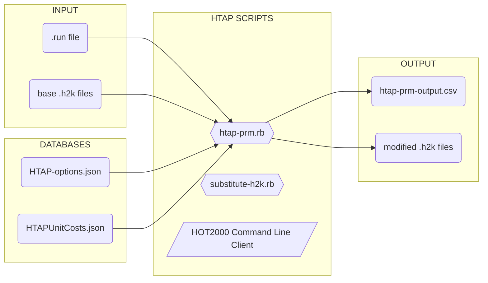
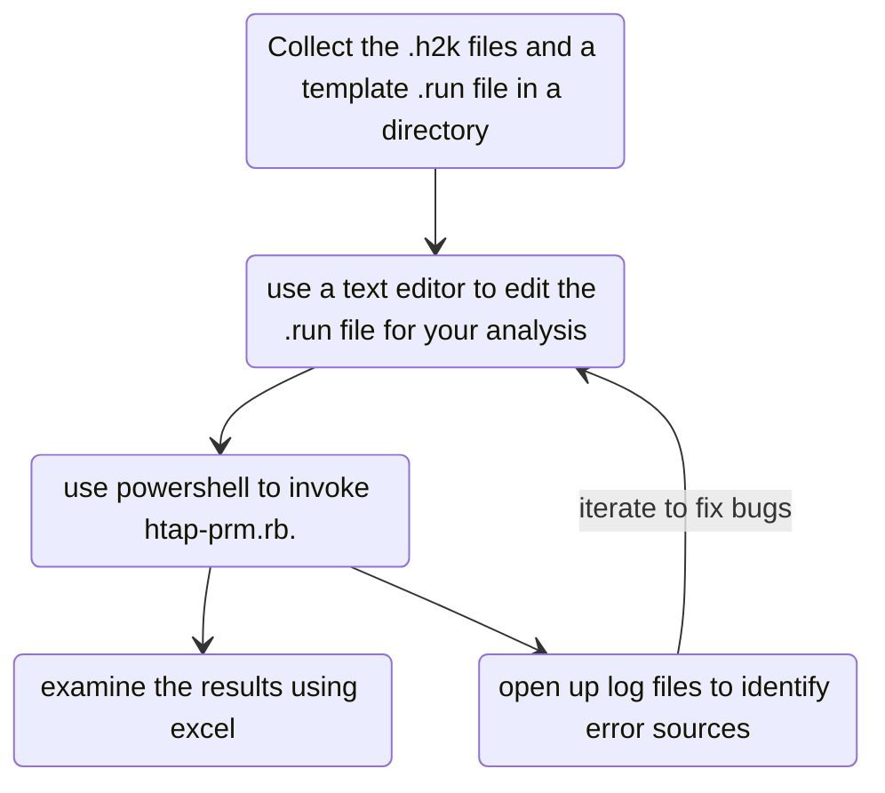
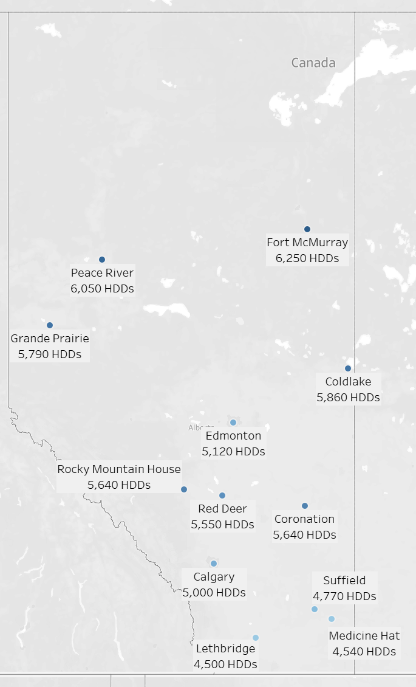
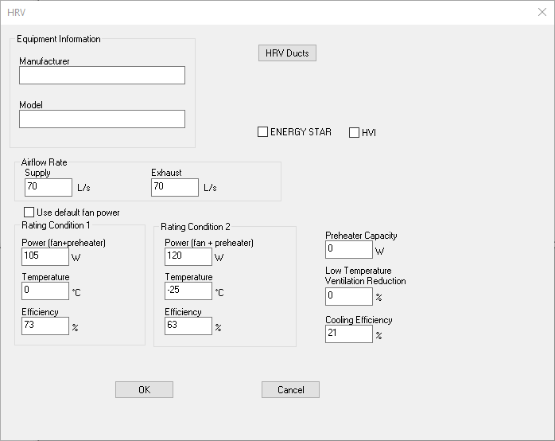
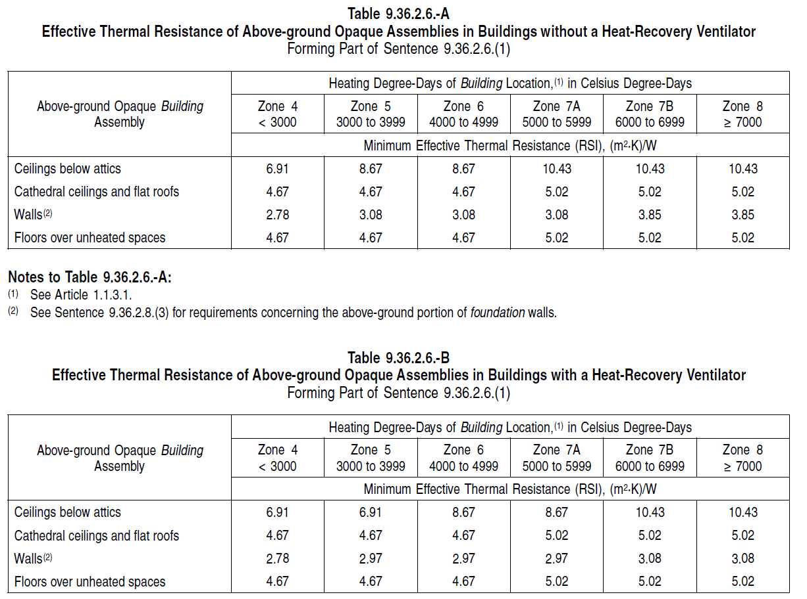
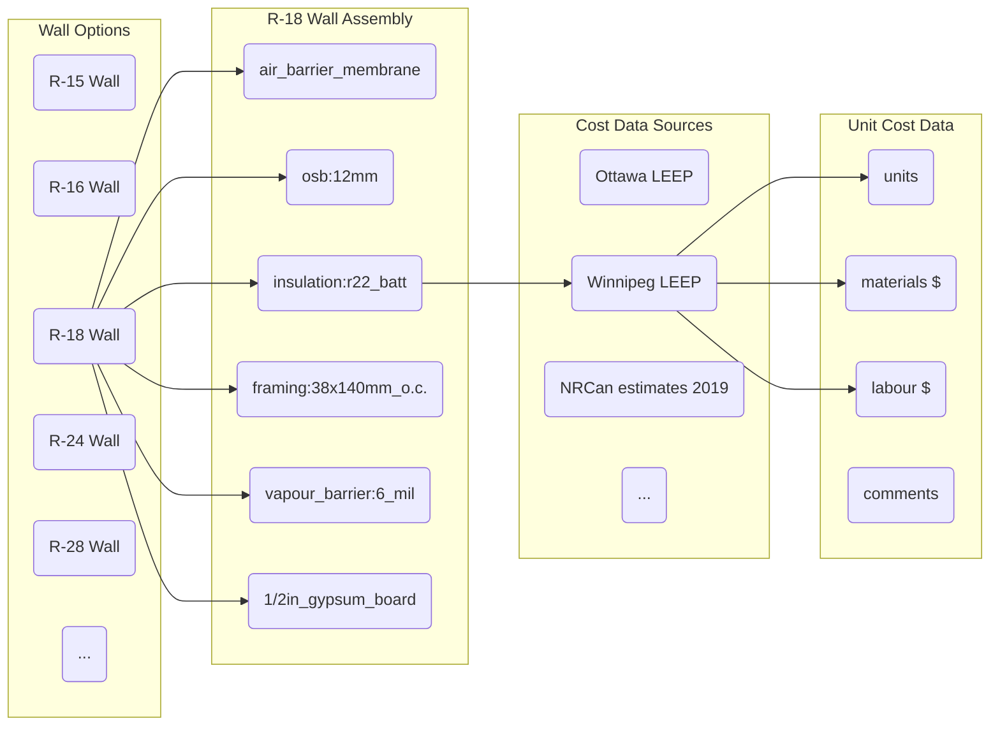
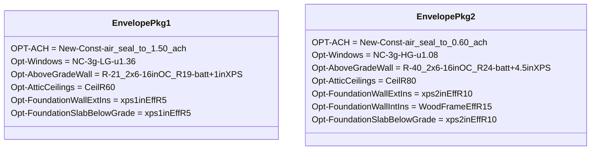

-----

# HTAP TRAINING 

==A guided syllabus for learning how to use NRCan's Housing Technology Assessment Platform (HTAP)==

---

Version of January 30

[TOC]


ad


---

# Prerequisites: Installing HTAP & Training materials #

----

To follow this training curriculum, you must first have HTAP installed. This curriculum also requires additional materials that are held in a separate training repository.

**Step 1:** Install HTAP:

Visit https://github.com/NRCan-IETS-CE-O-HBC/HTAP/blob/general-dev/doc/HTAP-installation.md, and follow the instructions there. 

==**NOTE:**== If you have already installed HTAP, you should sync your copy with the most recent version using the `git pull` command:

```
PS C:\Users> cd: C:\HTAP

PS C:\HTAP> git pull
Already up to date.
PS C:\HTAP>
```


**Step 2:** Download the training repository:

Using PowerShell, navigate to `C:\` and enter the command `git clone https://github.com/NRCan-IETS-CE-O-HBC/HTAP-Training.git`

```
PS C:\Users> cd: C:\
PS C:\> git clone https://github.com/NRCan-IETS-CE-O-HBC/HTAP-Training.git
Cloning into 'HTAP-Training'...
remote: Enumerating objects: 62, done.
remote: Counting objects: 100% (62/62), done.
remote: Compressing objects: 100% (37/37), done.
remote: Total 62 (delta 22), reused 55 (delta 19), pack-reused 0
Unpacking objects: 100% (62/62), done.
PS C:\>
```


**Updating with the most recent version:** If you have previously downloaded the training repository, update it to the most recent version with the following git commands: 

-  `git fetch --all`

```
PS C:\HTAP-Training> git fetch --all
Fetching origin
```


-  ` git reset --hard origin/master`

```
PS C:\HTAP-Training> git reset --hard origin/master
HEAD is now at 92f205a added module 2 and exercise
```


----

# Preface: Overview of HTAP #

----

## Concept ##

HTAP is a batch scripting tool for HOT2000. It is designed to automate many of the tasks HOT2000 users manually perform through the user interface, such as changing wall insulation levels and furnace efficiencies. HTAP can also take advantage of parallel computing power, making hundreds or thousands of simulations possible. 

HTAP includes databases for for energy conservation measures and construction costs. These features enable HTAP explore different scenarios for more energy-efficient design.

## Things HTAP can & can't do:  ##

| HTAP CAN:                                                    | HTAP CAN'T:                                                  |
| ------------------------------------------------------------ | ------------------------------------------------------------ |
| Edit site, insulation, air sealing, window, HVAC & PV parameters in hot2000 file | Change administrative inputs (such as builder name, EA contact details) |
| Perform operations across many .h2k files                    | Create a new .h2k file from scratch                          |
| Run thousands of different scenarios                         | Design a home                                                |
| Estimate upgrade costs for energy efficient housing          | Estimate utility costs[^1]                                   |
| Generate .csv and .json output for use in other tools        | Issue NRCan labels                                           |

[^1]: Future versions of HTAP will include utility price  forecast databases.

## HTAP Documentation ##

-  [HTAP-installation.md](https://github.com/NRCan-IETS-CE-O-HBC/HTAP/blob/general-dev/doc/HTAP-installation.md): brief document explaining how to install HTAP components and dependencies
-  [HTAP-quick-start.md](https://github.com/NRCan-IETS-CE-O-HBC/HTAP/blob/general-dev/doc/HTAP-quick-start.md): step-by-step guide for first-time users
-  [HTAP-input-and-output.md](https://github.com/NRCan-IETS-CE-O-HBC/HTAP/blob/general-dev/doc/HTAP-input-and-output.md): Comprehensive documentation on HTAP input files 


## HTAP User Tools ##

-  **Notepad++**: A text editor for editing HTAP files 
    

-  **Powershell**: A command line client for invoking HTAP scripts

-  **Windows Explorer**: File manager used to copy files for use in HTAP

-  **Spreadsheet**: Analysis tool used to examine HTAP's tabular output [^Alternate Tools]

     


[^Alternate Tools]: Other analysis tools are very effective at analyzing HTAP output from very large runs.  You may want to consider PowerBI (https://powerbi.microsoft.com/) or Tableau ([https://www.tableau.com](https://www.tableau.com/)). Traditional data analaysis platforms like Matlab & R will also prove useful if you are proficient in those tools. 


---

# Module 1: Basic HTAP Operations  #

---

Concepts introduced in this module:

-  Running HTAP from the command line
-  Editing run parameters
-  Troubleshooting errors 
-  Working with HTAP output 
-  Other command-line options


## INTRO TO: HTAP Architecture, Files & Usage ##

### HTAP Components ###

###### INPUTS - Parameters supplied or changed by HTAP users ######

-  The `.run` file defines the run parameters - such as which upgrades should be applied and which locations should be studied
-  The base `.h2k` files are provided by the HTAP user, who has previously created them using HOT2000

###### SCRIPTS & LIBRARIES -  Functional components that contain HTAP algorithms  ######

-  `HTAP-prm.rb` is the HTAP Parallel run manager. This is HTAP's highest-level script that manages runs. 
-  `substitute-h2k.rb` is a lower-level script that can manipulate HOT2000 files, invoke the HOT2000 command-line executable, and recover results.
-  The **HOT2000 Command Line Interface** is a special version of HOT2000 that has no user interface and can be run via the command line.

###### DATABASES - Files containing HTAP Data  ######

-  `HTAP-options.json` defines all the components within a HOT2000 model that HTAP knows how to manipulate, and options that they can be changed to
-  `HTAPUnitCosts.json` is a database of upgrade costs that HTAP uses to estimate capital cost impacts associated with changing a model

###### OUTPUTS - Data generated by HTAP  ######

-  HTAP-output

### HTAP Schematic ###



### A Typical HTAP session ###



## Activity 1 — Running HTAP from the command line ##

This activity will familiarize you with HTAP's command-line interface and output files. ==The files for this activity are located in `HTAP-Training\Basic_1`== 

>  **Task 1a:** Invoke HTAP's help message

**STEP 1:** Using PowerShell, navigate to the module folder using the command `cd C:\HTAP-Training\Basic_1\`. Output:

   ```
   PS C:\Users> cd C:\HTAP-Training\Basic_1\
   PS C:\HTAP-Training>
   ```


**STEP 2:** Invoke HTAP's help dialog using the command `C:\HTAP\htap-prm.rb -h`

```
PS C:\HTAP-Training\Basic_1> C:\HTAP\htap-prm.rb -h
Usage: htap-prm [options]

 Example: htap-prm.rb -o path\to\htap-options.json -r path\to\runfile.run -v

 Required inputs:

    -r, --run-def FILE               Specified run definitions file (.run)

 Configuration options:

    -t, --threads X                  Number of threads to use

        --compute-costs              Estimate costs for assemblies using
                                     costing database.

    -c, --confirm                    Prompt before proceeding with run. After
                                     estimating the size and duration of the run,
                                     HTAP will ask for conformation before continuing.

    -e, --extra-output               Report additional data on archetype and part-load
                                     characteristics

    -k, --keep-all-files             Preserve all files (including modified .h2k
                                     files) in HTAP-sim-X directories. Otherwise, only
                                     files that generate errors will be saved.

    -j, --json                       Provide output in JSON format
                                     (htap-prm-output.json) in additon to .csv output.
                                     Slows HTAP down, and make json output from
                                     large runs unwieldly.

    -l, --LEEP-Pathways              Export tables for use in LEEP pathways tool.

    -a, --include_audit_data         Include detailed audit data for costing
                                     calculations in JSON output. Slows HTAP down,
                                     and make json output unwieldy on
                                     large runs.

        --resume                     Attempt to resume prior interrupted run
                                     (experimental feature)

 Debugging options:

        --stop-on-error              Terminate run upon first error encountered.

    -h, --help                       Show help message

PS C:\HTAP-Training\Basic_1>

```


>  **TASK 1b:** Invoke HTAP for an already-configured run & examine outputs.

**STEP 1:**  Type `dir` to view the directory contents. You should find a single `.run` file inside: 

   ```
   PS C:\HTAP-Training\Basic_1> dir
   
   
       Directory: C:\HTAP-Training\Basic_1
   
   
   Mode                LastWriteTime         Length Name
   ----                -------------         ------ ----
   -a----       2020-01-07     15:33           1512 example.run
   
   ```

​      

**STEP 2:** Invoke HTAP with the command `C:\HTAP\htap-prm.rb -r .\example.run -c`, and answer `y` when prompted if you wish to continue.  HTAP's console output should look like the following:

   ```
   PS C:\HTAP-Training\Basic_1> C:\HTAP\htap-prm.rb -r .\example.run -c
   
   __________________________________________________________________________________
   = htap-prm: A simple parallel run manager for HTAP ===============================
   
    GitHub source:
       - Branch:   general-dev
       - Revision: 051c685
   
    Initialization:
       - Reading HTAP run definition from .\example.run...  done.
       - Evaluating combinations for parametric run
   
             * 3           { # of options for Location }
             * 1           { # of options for Archetypes }
             * 1           { # of options for Rulesets }
             *   (    1          { base option for all choices }
                  )
             ----------------------------------------------------------
              3               Total combinations
   
       - Creating parametric run for 3 combinations --- 3 combos created.
       - Guesstimated time requirements ~ 59 seconds (including pre- & post-processing)
   
       ? Continue with run ? [yes] y
   
   <<<<<<< SNIP >>>>>>>>
   
    - HTAP-prm: Run complete -----------------------
       + 3 files were evaluated successfully.
       + 0 files failed to run
   
   __________________________________________________________________________________
   = htap-prm: Run Summary ==========================================================
   
    Total processing time: 49.18 seconds
    -> Informational messages:
      (-) Info - Parsed options file C:/HTAP/HTAP-options.json
   
    -> Warning messages:
      (nil)
   
    -> Error messages:
      (nil)
   
    STATUS: Task completed successfully
   ==================================================================================
      
   PS C:\HTAP-Training\Basic_1>
   ```

   

**STEP 3.** Type `dir` to view the directory contents. You will find that HTAP has created a number of output files:

   ``` 
   PS C:\HTAP-Training\Basic_1> dir
   
   
       Directory: C:\HTAP-Training\Basic_1
   
   
   Mode                LastWriteTime         Length Name
   ----                -------------         ------ ----
   -a----       2020-01-07     15:33           1512 example.run
   -a----       2020-01-08     10:27              0 HTAP-prm-failures.txt
   -a----       2020-01-08     10:27           7477 HTAP-prm-output.csv
   -a----       2020-01-08     10:27              0 HTAP-prm-output.json
   -a----       2020-01-08     10:27             81 HTAP-prm.resume
   -a----       2020-01-08     10:27            431 htap-prm_log.txt
   -a----       2020-01-08     10:27            128 htap-prm_summary.out
   
   
   ```

   

   HTAP output files, in order of decreasing usefulness: 

| Filename:&nbsp;&nbsp;&nbsp;&nbsp;&nbsp;&nbsp;&nbsp;&nbsp;&nbsp;&nbsp;&nbsp;&nbsp;&nbsp;&nbsp;&nbsp;&nbsp;&nbsp;&nbsp;&nbsp;&nbsp;&nbsp;&nbsp;&nbsp;&nbsp;&nbsp;&nbsp;&nbsp;&nbsp;&nbsp;&nbsp; | Contents:                                                    | Used&nbsp;for:&nbsp;&nbsp;&nbsp;&nbsp;&nbsp;&nbsp;&nbsp;&nbsp;&nbsp;&nbsp;&nbsp;&nbsp;&nbsp;&nbsp; |
| ------------------------------------------------------------ | ------------------------------------------------------------ | ------------------------------------------------------------ |
| `HTAP-prm-output.csv`                                        | Results of HTAP run in tabular format. Formatted as comma- separated values. | Importing into spreadsheet or other analysis program         |
| `HTAP-prm-output.json`                                       | Results of HTAP run in structured data format. Formatted as nested hash. Includes warning, error and status messages, and more comprehensive data output than `.csv` results. This file is empty unless `htap-rpm.rb` is invoked with the `--json` option. | Importing into visualization software, application development |
| `HTAP-prm-failures.txt`                                      | List of files that failed to run.                            | Identifying problematic runs that need attention.            |
| `HTAP-prm.resume`                                            | Internal configuration file. Enables HTAP to resume a previously interrupted run. | Picking up where HTAP left off when your run crashed or stopped. |
| `htap-prm_log.txt`                                           | Messages describing HTAP's progress.                         | Developing HTAP                                              |
| `htap-prm_summary.out`                                       | Empty file currently generated by a bug in HTAP              | Nothing                                                      |

   

## Activity 2 — Editing run configuration ##

In this activity, you will begin working with HTAP configuration files and learn how to configure HTAP runs. ==The files for this activity  are located in `HTAP-Training\Basic_2`and in `HTAP-Training\h2k_files`== 

>  **TASK 2a:** Configure HTAP to run a different HOT2000 file in a different location.
>
>  HOT2000 files: 
>
>  -  `2Story-2100sqft-WalkOut.h2k`
>  
>  Locations: 
>
>  - Kamloops
>


**STEP 1:** Edit `example.run` using notepad++ 

-  Change the `archetypes` entry to reflect these .h2k files
-  Change the `locations` entry to include Vancouver and Kamloops

```
RunScope_START

  archetypes    =  2Story-2100sqft-WalkOut.h2k
  locations     = VANCOUVER, KAMLOOPS
  rulesets      = as-found

RunScope_END
```

-  Save the `.run` file. 


**STEP 2:** Run HTAP:

-  Invoke HTAP with the command `C:\HTAP\htap-prm.rb -r .\example.run -c`


**STEP 3:** Inspect the output.  

-  Open `HTAP-prm-output.csv` in a spreadsheet program
-  Inspect the following columns: 
   -  *archetype|h2k-file (~ column AY)*  - describes the h2k file used in each run
   -  *input|Opt-Location (~ column DE)* - describes the location where the HOT2000 simulation was run
   -  *output|\** - (~columns DS-FB) - describes HOT2000 data for each run


**QUESTION:**  

-  What happens if we misspell an entry in the run file — say `CAMLOOPS` ? 

   
  

>  **TASK 2b:** Configure HTAP to run the same analysis for two additional air-tightness specifications: 
>
>  -  ACH = 1.5 
>  -  ACH = 0.6

**STEP 1:** Locate the `OPT-ACH` entry in the run file:

```
Opt-ACH  = NA 
```

==NOTE:== The `NA` keyword instructs HTAP to leave the air-tightness specification unchanged. To change the air tightness specification, we need the corresponding keywords.


**STEP 2:** Open up the `HTAP-options.json` file in Notepad++, and locate the corresponding keywords

-  Open `C:\HTAP\HTAP-options.json`

-  Select *View: Fold-All*

-  Navigate to `"Opt-ACH"`: `"options"`, and locate appropriate keywords ( `New-Const-air_seal_to_1.50_ach`, `New-Const-air_seal_to_0.60_ach`)


**STEP 3:** Copy these keywords into your run file:

```
Opt-ACH = NA, New-Const-air_seal_to_1.50_ach, New-Const-air_seal_to_0.60_ach
```

Run HTAP and inspect results. Note field *input|ListOfUpgrades*

| archetype\h2k-File | input\Opt-Location | input\House-ListOfUpgrades | output\Energy-Total-GJ |
| -------- | -------- | -------- | -------- |
| 2Story-2100sqft-WalkOut.h2k | KAMLOOPS | - | 83 |
| 2Story-2100sqft-WalkOut.h2k | KAMLOOPS | Opt-ACH=>New-Const-air_seal_to_1.50_ach; | 78.2 |
| 2Story-2100sqft-WalkOut.h2k | KAMLOOPS | Opt-ACH=>New-Const-air_seal_to_0.60_ach; | 74.4 |


>  **TASK 2c:** Configure HTAP to include two different window specifications in the same analysis
>
>  -  Window A: U = 1.65, SHGC = 0.51
>  -  Window B: U = 1.65, SHGC = 0.19


**STEP 1:** Locate the `OPT-Windows` entry in the run file:

```
Opt-Windows     = NA
```


**STEP 2:** Browse the `HTAP-options.json` file and locate the relevant keywords from the `OPT-Windows` section (`NC-2g-HG-u1.65`,`NC-2g-LG-u1.65` )


**STEP 3:** Copy these keywords into the run file: 

```
Opt-Windows     = NA, NC-2g-HG-u1.65, NC-2g-LG-u1.65 
```

Run HTAP and inspect results. Note field *input|ListOfUpgrades*:


| archetype\h2k-File | input\Opt-Location | input\House-ListOfUpgrades | output\Energy-Total-GJ |
| -------- | -------- | -------- | -------- |
| 2Story-2100sqft-WalkOut.h2k | KAMLOOPS | - | 83 |
| 2Story-2100sqft-WalkOut.h2k | KAMLOOPS | Opt-ACH=>New-Const-air_seal_to_1.50_ach; | 78.2 |
| 2Story-2100sqft-WalkOut.h2k | KAMLOOPS | Opt-ACH=>New-Const-air_seal_to_0.60_ach; | 74.4 |
| 2Story-2100sqft-WalkOut.h2k | KAMLOOPS | Opt-Windows=>NC-2g-HG-u1.65; | 81.1 |
| 2Story-2100sqft-WalkOut.h2k | KAMLOOPS | Opt-Windows=>NC-2g-LG-u1.65; | 90 |

**QUESTION**

-  How many runs did we expect HTAP to complete?

   


>  **TASK 2d:** Configure HTAP to run every possible combination of window specification and air tightness
>
>  -  Window A: U = 1.65, SHGC = 0.51
>  -  Window B: U = 1.65, SHGC = 0.19
>  -  ACH = 1.5 
>  -  ACH = 0.6


**STEP 1:** Locate the run mode entry in the .run file

```
RunParameters_START
  run-mode                           = parametric
  archetype-dir                      = C:/HTAP-Training/h2k_files
  unit-costs-db                      = C:/HTAP/HTAPUnitCosts.json
  options-file                       = C:/HTAP/HTAP-options.json
RunParameters_END
```

==NOTE:== HTAP currently supports three different run modes: 

-  **parametric:** Runs every combination of archetype, location and ruleset. For each of those combinations, exercises each upgrade individually. 
-  **mesh:** Runs every combination of archetype, location, ruleset, and upgrade
-  **sample:** Randomly samples a specified number of runs from a the mesh solution space. 


**STEP 2:** Change the run mode to `mesh`

```
run-mode = mesh
```

Run HTAP and inspect results. Note field *input|ListOfUpgrades*:

| archetype\h2k-File | input\Opt-Location | input\House-ListOfUpgrades | output\Energy-Total-GJ |
| -------- | -------- | -------- | -------- |
| 2Story-2100sqft-WalkOut.h2k | KAMLOOPS | - | 83 |
| 2Story-2100sqft-WalkOut.h2k | KAMLOOPS | OptWindows=>NC-2g-HG-u1.65; | 81.1 |
| 2Story-2100sqft-WalkOut.h2k | KAMLOOPS | OptWindows=>NC-2g-LG-u1.65; | 90 |
| 2Story-2100sqft-WalkOut.h2k | KAMLOOPS | Opt-ACH=>New-Const-air_seal_to_1.50_ach; | 78.2 |
| 2Story-2100sqft-WalkOut.h2k | KAMLOOPS | Opt-ACH=>New-Const-air_seal_to_1.50_ach;  OptWindows=>NC-2g-HG-u1.65; | 76.4 |
| 2Story-2100sqft-WalkOut.h2k | KAMLOOPS | Opt-ACH=>New-Const-air_seal_to_1.50_ach;  OptWindows=>NC-2g-LG-u1.65; | 84.9 |
| 2Story-2100sqft-WalkOut.h2k | KAMLOOPS | Opt-ACH=>New-Const-air_seal_to_0.60_ach; | 74.4 |
| 2Story-2100sqft-WalkOut.h2k | KAMLOOPS | Opt-ACH=>New-Const-air_seal_to_0.60_ach; OptWindows=>NC-2g-HG-u1.65; | 72.5 |
| 2Story-2100sqft-WalkOut.h2k | KAMLOOPS | Opt-ACH=>New-Const-air_seal_to_0.60_ach; Opt_Windows=>NC-2g-LG-u1.65; | 80.9 |


## Activity 3 — Typical HTAP analysis runs ##

This activity will familiarize you with some common HTAP analysis tasks.  ==The files for this activity  are located in `HTAP-Training\Basic_3`and in `HTAP-Training\h2k_files`==

>  **Task 3a:** Estimate the energy savings associated with upgrading the windows and adding ceiling insulation in a four-unit row-house. 
>
>  197-203 Presland is a 70-year-old row-housing unit managed by Ottawa Community Housing. All four units are due for window replacement, and the property manager also wonders if she should add more insulation to the attic. 
>
>  
>
>  You have four hot2000 files corresponding to each of the units: `197-Presland.h2k`, `199-Presland.h2k`, `201-Presland.h2k`, `203-Presland.h2k`
>
>   Estimate the energy savings that can be achieved with the following options: 
>
>  -  Attic insulation upgraded to R30, R40, R50 effective
>  -  Windows upgraded to: mid-gain double pane (U=1.65), mid-gain triple pane (U=1.36), mid-gain very high performance (U=1.08)


**STEP 1:** Edit the `.run` file to include all of the archetypes: 

```
archetypes = 197-Presland.h2k, 199-Presland.h2k, 201-Presland.h2k, 203-Presland.h2k
```

==**TIP:**== HTAP supports wildcard inputs in the `.run` file. For instance, `archetypes = *Presland.h2k` would instruct HTAP to run all HOT2000 files with names containing the text "Presland.h2k". Setting `locations = *` causes HTAP to run the analysis in all locations supported by HOT2000.


**STEP 2:** Edit the `.run` file so that the location is set to Ottawa 

```
  locations   = OTTAWA
```


**STEP 3:** Edit the upgrades section to include the desired attic and window specifications. 

Browse the `HTAP-options.json`, and pick relevant options for `Opt-Windows` and `Opt-AtticCeilings`. Run HTAP and inspect results.  Results for all four homes:

| Upgrade                         | Total energy use - all four units (GJ/year) | % Savings |
| ------------------------------- | ------------------------------------------: | --------: |
| Base case                       |                                       415.7 |        0% |
| Ceilings: R40                   |                                       413.5 |        1% |
| Ceilings: R50                   |                                       411.6 |        1% |
| Ceilings: R60                   |                                       410.4 |        1% |
| Windows: U = 1.65               |                                       388.0 |        7% |
| Windows: U = 1.36               |                                       381.2 |        8% |
| Windows: U = 1.08               |                                       374.8 |       10% |
| Ceilings: R40 & Windows: U=1.65 |                                       385.8 |        7% |
| Ceilings: R50 & Windows: U=1.36 |                                       377.1 |        9% |
| Ceilings: R60 & Windows: U=1.08 |                                       369.3 |       11% |

==**TIP:**== If your computer has multiple CPU cores, you can use the `--threads` (or `-t`)  option to speed up run times. Buy default, HTAP will run simulations using three separate threads. This works well on most computers, which commonly have 4 CPU cores. But some computers may have 8 or more cores. Invoking HTAP with the `--treads 8` will greatly speed things up. 


>  **Task 3b:** Examine the effectiveness of installing HRVs in a range of locations in Alberta. 
>
>  
>
>  An Alberta utility representative is curious about how much energy HRVs could save in Alberta. Use HTAP to compare the energy use of HRVs over ventilation fans, using a single archetype (`2Story-2100sqft-FullBsmt.h2k`).
>
>  Consider at least two scenarios: 
>
>  -  Ventilation fans without heat recovery
>  -  70% efficient HRV
>
>  Run the following locations:
>
>  -  Calgary, Edmonton, Fort McMurray, Lethbridge, Rocky Mountain House, Suffield, Cold Lake, Coronation, Grande Prairie, Medicine Hat, Peace River, Red Deer


**STEP 1:** Edit the `.run` file to specify the archetype

```
archetypes = 2Story-2100sqft-FullBsmt.h2k
```


**STEP 2:** Edit the `.run` to include all of the required locations

```
  locations   =  CALGARY, EDMONTON, FORTMCMURRAY, LETHBRIDGE, ROCKYMOUNTAINHOUSE, SUFFIELD, COLDLAKE, CORONATION, GRANDEPRAIRIE, MEDICINEHAT, PEACERIVER, REDDEER
```

==**NOTE:**== HTAP requires all of the locations to be specified on a single line!


**STEP 3:** Edit the upgrades section to include the desired ventilation specifications. 

Browse the `HTAP-options.json`, and pick relevant options for `Opt-VentSystem `. Set all other upgrades to NA.

```
   Opt-VentSystem       = VentFans_sre_0, HRV_sre_70
```

Run HTAP and inspect results.  Results for all four homes:

| input\Opt-Location | output\HDDs | Heating energy w/ Fans (GJ) | Heating energy  w/ HRV (GJ) | Savings |
| -------- | -------- | -------- | -------- | -------- |
| Calgary | 5000 | 110.2 | 100.6 | 8.7% |
| Edmonton | 5120 | 133 | 122.3 | 8% |
| Fort McMurray | 6250 | 159.9 | 148.3 | 7.3% |
| Lethbridge | 4500 | 101.8 | 93.2 | 8.4% |
| Rocky Mountain House | 5640 | 125.3 | 114.6 | 8.5% |
| Suffield | 4770 | 110.9 | 101.7 | 8.3% |
| Cold Lake | 5860 | 146.9 | 135.9 | 7.5% |
| Coronation | 5640 | 141.2 | 130.3 | 7.7% |
| Grande Prairie | 5790 | 140.5 | 129.7 | 7.7% |
| Medicine Hat | 4540 | 109.2 | 100.1 | 8.3% |
| Peace River | 6050 | 157 | 145.4 | 7.4% |
| Red Deer | 5550 | 139.9 | 128.6 | 8.1% |

**QUESTIONS**

-  How did the HRV affect energy use - for heating? For ventilation? 
-  How could we instruct HTAP to use an exact HRV spec?


>  **Task 3c:** Use HTAP to compare these exact ventilation specifications for the same archetype (`2Story-2100sqft-FullBsmt.h2k`) and Alberta locations (Calgary, Edmonton, Fort McMurray, Lethbridge, Rocky Mountain House, Suffield, Cold Lake, Coronation, Grande Prairie, Medicine Hat, Peace River, Red Deer)
>
>  | Specification               | Vent fans | HRV   |
>  | --------------------------- | --------- | ----- |
>  | System type                 | Utility   | HRV   |
>  | Supply flow rate            | 70 l/s    | Same  |
>  | Exhaust flow rate           | 70 l/s    | Same  |
>  | Fan power @ 0°C             | 120 W     | 105 W |
>  | Fan power @-25°C            | —         | 120 W |
>  | SRE @ 0° C                  | —         | 73%   |
>  | SRE @ -25° C                | —         | 63%   |
>  | Cooling recovery efficiency | —         | 21%   |
>
>  **NOTE:** The `HTAP-options.json`file does not have pre-configured options for these specific ventilation systems.

**STEP 1:**  Make two copies of the archetype's hot2000 file (e.g. ``2Story-2100sqft-FullBsmt_VentFan.h2k` and `2Story-2100sqft-FullBsmt_HRV.h2k`)


**STEP 2:** Using HOT2000, edit the ventilation specifications to reflect the ventilation fan and HRV scenarios. 



**STEP 3:** Configure the .run file to specify both archetype variants 

```
archetypes   = 2Story-2100sqft-FullBsmt_vent-fans.h2k, 2Story-2100sqft-FullBsmt_hrv.h2k
```

Ensure that all upgrade options are set to `NA` (including `Opt-VentSystem `). Run HTAP and inspect the results. 


**QUESTIONS**

-  What if you were asked to study the impact of these specifications alongside standard HTAP options (such as air-tightness)?

   
  
  

-----

# MODULE 2: Solving Real World Problems With HTAP #

-----

Concepts introduced in this module:

-  NBC rulesets
-  HTAP's costing calculations
-  Upgrade packages 
-  Archetype housing models


## INTRO TO: Rulesets ##

HTAP Rulesets automate application of energy efficiency requirements to HOT2000 models. 



### Objectives ###

-  Make it easy to generate the reference house
-  Support %-better-than comparisons with the code 


### Scope  ###

**Prescriptive requirements of the code**

-  Opaque envelope R-values
-  Fenestration U-values
-  Mechanical system efficiencies

**Modelling rules for 9.36.5**

-  Base loads and Ventilation schedules
-  Air-tightness assumptions
-  Reference house window areas and distributions


### Roadmap Status ###

HTAP Rulesets are a work-in-progress. Currently, rulesets are available for the following scenarios:

- [x] NBC 9.36
- [ ] Provincial energy requirements
- [ ] Step Codes & NBC tiered codes
- [ ] EnergyStar, R-2000, NZE-Ready, PH


### Ruleset Definitions ###

-  `as-found`: don't apply any rulesets
-  `NBC9_36`: model the home according to the requirements of NBC 9.36.5, for the appropriate climate zone and fuel type. Note: this ruleset accepts additonal specifications: `NBC9_36[fuel>keyword1;vent>keyword2]`

| Spec / Keyword | Intrepretation                                               |
| -------------- | ------------------------------------------------------------ |
| `fuel>gas`     | Set heating / hot water equipment to minimums for gas-heated equipment in 9.36.4 |
| `fuel>elect`   | Set heating / hot water equipment to minimums for electric-resistance equipment in 9.36.4 |
| `vent>HRV`     | Use prescriptive requirements (envelope & mechanical) for homes equipped with HRVs |
| `vent>noHRV`   | Use prescriptive requirements (envelope & mechanical) for homes not equipped with HRVs |


### Points to remember ###

-  Changing entries in the upgrades section (say `Opt-ACH`) causes those changes to be applied on top of the ruleset.
-  Setting `Rulesets  = NBC9_36` causes HTAP to change the model's window distribution and base loads to meet 9.36.5 modelling rules. To override this behavior, explicitly set these parameters in the upgrades section (e.g. `Opt-Baseloads = ERS-Single-regular-19.5kWh&190_per_day` and `Opt-WindowDistribution = Proposed-9.36`)

## Activity 4 — Comparing results to NBC code minimum ##

In this activity, you will use HTAP's NBC ruleset to make comparisons with the National Building Code. The files for this activity are located in `C:\HTAP-Training\Intermediate_4>`


>  **Task 4a:** A Calgary-Area low-energy home builder wants to know how much more efficient their home is than the National Building Code. Evaluate their performance relative to NBC 9.36.5


**STEP 1:** Configure `rulesets-example.run` to point to `AB-LowEnergy.h2k` 

```
archetypes   = AB-LowEnergy.h2k
```


**STEP 2:** Set the `rulesets` parameter to include both `as-found` `rulesets-example.run` to point to `AB-LowEnergy.h2k` 

```
  rulesets             = as-found, NBC9_36
```


**STEP 3:** Set the `OPT-baseloads` parameter to `NBC-Baseloads` to ensure consistent comparisons 

```
Opt-Baseloads        = NBC-Baseloads
```


**STEP 4:** Run HTAP and inspect results 

```
PS C:\HTAP-Training\Intermediate_4>C:\HTAP\htap-prm.rb -r .\rulesets-example.run -k 
```

Note column 

| Ruleset  | Total energy use (GJ/yr) | % Improvement |
| -------- | -----------------------: | ------------: |
| NBC9_36  |                    106.8 |             — |
| as-found |                     58.8 |           44% |


>  **Task 4b:** Estimate the energy savings that drain-water heat recovery will achieve in five different climate zones relative to code, when heated with electricity and natural gas

**STEP 1:** Configure `rulesets-example.run` to point to `2Story-2100sqft-FullBsmt.h2k` 

```
archetypes   = 2Story-2100sqft-FullBsmt.h2k
```


**STEP 2:** Set the locations to cities in Climate zones (e.g.  Victoria, Toronto,  Fredericton, Winnipeg, Whitehorse, Uranium City)

```
  locations   = VICTORIA, TORONTO, FREDERICTON, WINNIPEG, WHITEHORSE, URANIUMCITY
```


**STEP 3:** Set the `rulesets` parameter to NBC9_36, with separate variants for electric and gas heated homes. 

```
  rulesets    = NBC9_36[fuel>elect], NBC9_36[fuel>gas]
```


**STEP 4:** Set the Opt-DWHR parameter to  `NA`, and `DWHR-eff-30`, `DWHR-eff-55`

```
Opt-DWHR   = NA, DWHR-eff-30, DWHR-eff-55
```


**STEP 5:** Run HTAP and inspect results 

```
PS C:\HTAP-Training\Intermediate_4>C:\HTAP\htap-prm.rb -r .\rulesets-example.run -k 
```

*Results for electrically-heated homes:* 

| Location     | Climate Zone | HDDs | DHW Energy, w/o DWHR | DHW Energy, w/ DWHR | % savings |
| ------------ | ------------ | ---: | -------------------: | ------------------: | --------: |
| Victoria     | Zone 4       | 2650 |              17.3 GJ |             15.7 GJ |        9% |
| Toronto      | Zone 5       | 3520 |              17.6 GJ |             15.9 GJ |       10% |
| Fredericton  | Zone 6       | 5670 |              18.7 GJ |              16.7GJ |       11% |
| Winnipeg     | Zone 7A      | 5670 |              19.4 GJ |              17.2GJ |       11% |
| Whitehorse   | Zone 7B      | 6580 |              20.4 GJ |             18.0 GJ |       12% |
| Uranium City | Zone 8       | 7500 |              20.4 GJ |             17.9 GJ |       12% |


*Results for gas-heated homes:* 

| Location     | Climate Zone | HDDs | DHW Energy, w/o DWHR | DHW Energy, w/ DWHR | % savings |
| :----------- | :----------- | ---: | -------------------: | ------------------: | --------: |
| Victoria     | Zone 4       | 2650 |              26.4 GJ |             24.4 GJ |        8% |
| Toronto      | Zone 5       | 3520 |              26.8 GJ |             24.7 GJ |        8% |
| Fredericton  | Zone 6       | 5670 |              28.2 GJ |             25.7 GJ |        9% |
| Winnipeg     | Zone 7A      | 5670 |              29.1 GJ |             26.4 GJ |        9% |
| Whitehorse   | Zone 7B      | 6580 |              30.5 GJ |             27.5 GJ |       10% |
| Uranium City | Zone 8       | 7500 |              30.4 GJ |             27.3 GJ |       10% |


## INTRO TO: HTAP's Costing Calculations ##

Since 2012, Natural Resources Canada (NRCan) has collected estimates for the costs of **applying energy efficiency measures** in Canadian housing. Over the last seven years, the following initiatives have made of use of these estimates, and contributed new data:

1. Local Energy Efficiency Partnerships (LEEP) 
2. Northern Territorial Optimization Studies
3. BC Step Code Metrics Research Report 
4. Codes-Canada impact assessments for tiered energy codes


### Objectives  ###

NRCan collects costing data to fulfill the following objectives: 

1. To estimate the capital cost impact associated with choosing one energy-efficiency over another, in the design of a house.
2. To enable comparisons between upfront investments in energy efficiency, and savings in operating costs over the life of the project. 

NRCan intends this data to aid cost estimations relative to baseline construction. Codes and programs may use it to estimate cost impacts relative to benefits. 


### Uncertainty in Cost Estimation ###

Estimating cost impacts is not trivial, because: 

1. construction costs are highly variable, and 
2. costing data is scarce. 

Costs will vary by season — according to changes in demand, and by region — according to local practices and custom. Costs will also vary by builder. For instance, larger builders may negotiate volume pricing discounts for materials and equipment. 


### Sources of Uncertainty  ###

| Source                 | Description                                                  |
| ---------------------- | ------------------------------------------------------------ |
| **Baseline**           | Not all builders construct code-minimum homes. Many build to improved standards, such as ENERGY STAR or Novoclimat. Others may include improved construction details or superior equipment as part of their product offering. These builders are starting from a higher baseline, and will face lower overall upgrade costs than builders following minimum requirements. |
| **Readiness**          | Industry readiness varies between builders and trades. New technologies and approaches take time to learn and to refine. Some builders and trades improved their ability to innovate by exploring new technologies and approaches through trial or *discovery* homes. These builders are likely to succeed in incorporating energy efficiency measures with the smallest possible cost and schedule changes. Other builders may find that these changes bring significant disruption and cost increases to their practices. |
| **Business practices** | A builder’s business practices may limit their ability to adopt the lowest cost approach. For instance, builders using modular or panelized components in their homes may find that the lowest cost envelope details are incompatible with their manufacturing or transportation processes, and a higher-cost alternative is necessary. |
| **Client preferences** | Homebuyer needs may prevent them from adopting the lowest-cost path to an energy savings target. For instance, electric resistance heating is both cheaper to install and more efficient than gas combustion equipment, but much more expensive to operate in many parts of Canada. Homebuyer preferences for gas heating may prohibit builders from adopting this approach. |
| **Experience**         | Builder costs are generally highest when they first adopt new energy efficient measures, and decline upon successive iterations. This is because builders and trades often use hands-on experiences to refine and improve their practices, and to choose lower-cost alternatives. |
| **Demand**             | Costs associated with novel materials and equipment are affected by demand. Early adopters will generally pay the highest costs for new technologies. As rates of adoption grow, new suppliers, skilled trades and new distribution channels will emerge. Builders will have more flexibility, and costs will drop. |
| **Markup**             | Builders and trades universally use mark-up as a means to earn wages and salaries on the homes they construct. But policies on how mark-up and profit margins are applied to homes and energy efficiency details vary across the industry. Different approaches to markup will result in different cost impacts. |


### Exclusions and Limitations ###

| Current Limitation               | Reason                                                       |
| -------------------------------- | ------------------------------------------------------------ |
| **Energy Efficient measures**    | HTAP data cannot be used to develop estimates for complete construction projects, because many elements (e.g. internal finishing, foundation walls) are out of scope, or are assumed to be identical between baseline and upgrade cases. |
| **No regional cost differences** | While NRCan has  collected data from multiple regional sources, the breadth of NRCan’s  activities is not sufficient to meaningfully examine cost differences   between cities or provinces. |
| **No prefab data**               | Nearly all of the data collected by NRCan reflects conventional, site-built approaches to home construction. Most of the envelope measures reflect stick-frame construction. While some of NRCan’s materials and labour costs are still relevant to prefabricated or panelized builders, costs in factory-build applications will be different. |
| ==**HVAC system sizing**==       | HTAP currently has limited support for costing HVAC equipment according to capacity. Baseboards and GSHP systems are supported, CCASHP, ASHP and furnaces are not yet supported. |

==NRCan's energy efficiency cost data as **indicative, but not definitive**==

### Structure & Schema ###




### Things you should know: ###

-  Not all of the entries in the `HTAP-options.json` file have cost data associated with them. Some will return zero-cost.  To ensure the entry you wish to use has cost data, inspect the `"Costs: {"Comoponents":[]}"` entry. If it is empty, HTAP will not compute costs.

   ```json
     "Opt-DWHR": {
       "structure": "tree",
       "costed": true,
       "options": 
         "DWHR-eff-30": {
           "h2kMap": {...},
           "costs": {
             "components": [
               "dwhr_unit:91cm_supply",
               "pex_pipe_to_and_from_dwhr_and_dhw_systems:15_ft_run"
             ],
             "custom-costs": {
             }
           }
         },
         "DWHR-eff-42": {
           "h2kMap": { ... },
           },
           "costs": {
             "custom-costs": {
             },
             "components": [
   
             ]
           }
         }
       
   ```

   

-  the `HTAP-options.json` file also contains placeholders for "custom-costs". This feature is not yet supported. 

## Activity 5 — Using HTAP to compare costs for new construction ##

This activity will introduce you to HTAP's costing data and calculation methods. The files for this activity are located in `C:\HTAP-Training\Intermediate_5>`

>  **Task 4a:** An Edmonton builder currently builds a 2100 ft² home to the minimum requirements of the NBC. What is the cost/benefit of upgrading the wall spec to the following performance levels:
>
>  -  R-19 effective
>-  R-21 effective
>  -  R-23 effective
>  -  R-26 effective
>  -  R-29 effective
>  -  R-40 effective


**STEP 1:** Configure the `wall-costs.run` file to use the specified archetype

```
archetypes   = 2Story-2100sqft-FullBsmt.h2k
```

**STEP 2:** Set the locations to cities in Climate zones (e.g.  Victoria, Toronto,  Fredericton, Winnipeg, Whitehorse, Uranium City)

```
  locations   = EDMONTON
```


**STEP 3:** Set the `rulesets` parameter to NBC9_36 (and use the `fuel>gas` variant) 

```
  rulesets    = NBC9_36[fuel>gas]
```


**STEP 4:** Set the `Opt-AboveGradeWalls` parameter to reference the desired wall specifications

```
Opt-AboveGradeWall = NA,
                     NC_R-19(eff)_2x4-16inOC_R14-batt+1.5inXPS_poly_vb,
                     NC_R-21(eff)_2x6-16inOC_R19-batt+1inXPS_poly_vb, 
                     NC_R-23(eff)_2x6-16inOC_R24-batt+1inXPS_poly_vb,
                     NC_R-26(eff)_2x6-16inOC_R19-batt+2inXPS_poly_vb, 
                     NC_R-29(eff)_2x6-24inOC_R24-batt+2inXPS_poly_vb, 
                     NC_R-40(eff)_2x6-16inOC_R24-batt+4.5inXPS_poly_vb  
```

*(Remember, HTAP requires all of these entries to be on a single line)*


STEP 5:** Run HTAP 

```
PS C:\HTAP-Training\Intermediate_5>C:\HTAP\htap-prm.rb -r .\wall-costs.run -k 
```

*(Remember: Using the `-k` option instructs HTAP to save the resulting simulation files in folders named `)*


**STEP 4:** Inspect results. Note the content of the following columns in `htap-prm-output.csv`:

-  **CJ** - input|Opt-AboveGradeWall
-  **DX** - output|Energy-HeatingGJ
-  **BO** - cost-estimates|byAttribute|Opt-AboveGradeWall
-  **BY** - cost-estimates|byBuildingComponent|envelope
-  **CE** - cost-estimates|total

| Wall spec    | Envelope costs | Incremental Cost | Heating Energy | Energy Savings | Cost per GJ saved |
| ------------ | -------------: | -------------------: | -------------: | -------------: | ---: |
| NBC minimum | $ 22,396.22 |               $ 0.00 |      66.3 GJ |           0 GJ | - |
| NC_R-19(eff) |     $25,018.22 |       $ 2,622.00 |        62.5 GJ |            3.9 GJ | $ 672.31 / GJ |
| NC_R-21(eff) |    $ 25,012.19 | $ 2,615.97 |        60.7 GJ |            5.7 GJ | $ 458.94 / GJ |
| NC_R-23(eff) |    $ 25,398.61 | $ 3,002.39 |        59.2 GJ |            7.2 GJ | $ 417.00 / GJ |
| NC_R-26(eff) |    $ 26,569.09 | $ 4,172.87 |        56.8 GJ |            9.6 GJ | $ 434.67 / GJ |
| NC_R-29(eff) |    $ 26,804.31 | $ 4,408.09 |        55.4 GJ |           11.0 GJ | $ 400.74 / GJ |
| NC_R-29(eff) |    $ 33,670.79 | $ 11,274.57 |        51.2 GJ |           15.2 GJ | $ 741.75 / GJ |


**STEP 5:** View the cost audit report for one of the simulations. When run with the `-k` option, HTAP will create costing-calculation report for each simulation, and save in in the `HTAP_sim_x` directory. Navigate to that directory and inspect the file `HTAP-costing-audit-report.txt`. 

An excerpt of that report follows:


```
===================================================================================
= substitute-h2k: HTAP Costing - Audit Report  
= C:\HTAP-Training\Intermediate_4\HTAP-work-3\2Story-2100sqft-FullBsmt.h2k 
= 2020-01-27 13:27:31 -0500 
===================================================================================

This report details HTAP's costing calculations.

Cost summary:
 ..................................................................................
 Option                          Choice                                   Cost 
 ..................................................................................
 Ceilings                   NA                                     $      0.00 
 AtticCeilings              NA                                     $      0.00 
 FlatCeilings               NA                                     $      0.00 
 CathCeilings               NA                                     $      0.00 
 ACH                        NA                                     $      0.00 
 Windows                    NA                                     $      0.00 
 DWHR                       NA                                     $      0.00 
 AboveGradeWall             R-23(eff)_2x6-16inOC_R24-batt+1inXPS   $  10545.87 
 Heating-Cooling            NA                                     $      0.00 
 VentSystem                 NA                                     $      0.00 
 DHWSystem                  NA                                     $      0.00 
 FoundationWallExtIns       NA                                     $      0.00 
 FoundationWallIntIns       NA                                     $      0.00 
 FoundationSlabBelowGrade   NA                                     $      0.00 
 FoundationSlabOnGrade      NA                                     $      0.00 
 FloorHeaderIntIns          NA                                     $      0.00 
 ExposedFloor               NA                                     $      0.00 
 ..................................................................................
 Total                                                             $  10545.87 

___________________________________________________________________________________
= substitute-h2k: Choice-by-Choice costing calculations ===========================

#1) Opt-ACH = NA
===================================================================================
Cost Component:   [( Mat.$ + Lab.$ ) = Cost $] * [ Qty.]  = [  Cost $  ]     
...................................................................................
as per h2k file      0.00    0.00      0.00       0.00         0.00   
...................................................................................
TOTAL:                                                         0.00   

#2) Opt-Windows = NA
===================================================================================
Cost Component:   [( Mat.$ + Lab.$ ) = Cost $] * [ Qty.]  = [  Cost $  ]     
...................................................................................
as per h2k file      0.00    0.00      0.00       0.00         0.00   
...................................................................................
TOTAL:                                                         0.00   
 
#3) Opt-AboveGradeWall = NC_R-23(eff)_2x6-16inOC_R24-batt+1inXPS_poly_vb
===================================================================================
Cost Component:   [( Mat.$ + Lab.$ ) = Cost $] * [ Qty.]  = [  Cost $  ]   
...................................................................................
xps type 4: 25mm    0.84     0.68     1.52      1875.78      2851.18   sq.ft - AG w
air barrier mem.    0.12     0.26     0.38      1680.06       638.42   sq.ft - AG w
osb: 12mm           0.26     0.00     0.26      1680.06       436.82   sq.ft - AG w
r24 batt            0.97     0.38     1.35      1680.06      2268.09   sq.ft - AG w
framing: 38x140mm   0.63     0.81     1.44      1680.06      2419.29   sq.ft - AG w
vapour barrier      0.11     0.28     0.39      1680.06       655.22   sq.ft - AG w
1/2in gypsum board  0.35     0.41     0.76      1680.06      1276.85   sq.ft - AG w 
...................................................................................
TOTAL:                                                       10545.87    

```


**Questions:**

-  Why did HTAP only compute costs for wall systems? 

-  What would happen if we included `NA` in the list of wall systems? 

-  What if we wanted to explore the cost-benefit from added insulation on heating system sizing? 

   

>  **Task 5b:** Based on that analysis, the same builder wants to information on the costs and benefits of upgrading three different designs from R-16 to homes to R-29. Complete the analysis for:
>
>  -  a one story 1000 ft² detached design
>  -  a two story, 1500 ft² attached design (mid and end units)
>  -  a two story, 3500 ft² detached design. 


**STEP 1:** Configure the `wall-costs.run` file to use the specified archetypes

```
archetypes   = 1Story_1000-sq-ft.h2k, 
               2Story_1500_sq_ft-RowMid.h2k, 
               2Story_1500_sq_ft-RowEnd.h2k, 
               2Story-3500sqft_fullBsmt.h2k
```

(Remember, these must be defined on a single line within the `.run` file)

**STEP 2:** Set the `Opt-AboveGradeWalls` parameter to reference the desired wall specifications

```
Opt-AboveGradeWall = NC_R-16(eff)_2x6-24inOC_R19-batt_poly_vb, 
                     NC_R-29(eff)_2x6-24inOC_R24-batt+2inXPS_poly_vb
```


**STEP 3:** Run HTAP and inspect results

```
PS C:\HTAP-Training\Intermediate_4>C:\HTAP\htap-prm.rb -r .\wall-costs.run -k 
```

*(Remember: Using the `-k` option instructs HTAP to save the resulting simulation files in folders named `HTAP-sim-X`)*

| Archetype                      | AG Wall Area (m²) | Energy Savings (GJ/yr) | Incremental costs ($) |
| ------------------------------ | ----------------: | ---------------------: | --------------------: |
| `1Story_1000-sq-ft.h2k`        |                59 |                    3.8 |            $ 1,834.19 |
| `2Story_1500_sq_ft-RowMid.h2k` |                64 |                    4.3 |            $ 1,993.28 |
| `2Story_1500_sq_ft-RowEnd.h2k` |                93 |                    6.5 |            $ 2,877.39 |
| `2Story-3500sqft_fullBsmt.h2k` |               256 |                   19.1 |            $ 7,882.06 |


## INTRO TO: Upgrade Packages ##

### Dealing with large combinations  ###

HTAP currently supports two run modes:

-   `runmode = parametric` instructs HTAP to run a base case, and an additional variant for every upgrade applied, individually
-  `runmode = mesh` instructs HTAP to run all combinations of upgrades.

If you are interested in numerous potential upgrades, you must choose between running countless combinations, or no combinations at all. 

***Parametric mode*:**

```
__________________________________________________________________________________________
= htap-prm: A simple parallel run manager for HTAP =======================================

 GitHub source:
    - Branch:   general-dev
    - Revision: 4b887ef

 Initialization:
    - Reading HTAP run definition from .\large-mesh-example.run...  done.
    - Evaluating combinations for parametric run

          * 1           { # of options for Location }
          * 1           { # of options for Archetypes }
          * 1           { # of options for Rulesets }
          *   (    1          { base option for all choices }
                +  3          { additional options for Opt-ACH }
                +  5          { additional options for Opt-Windows }
                +  6          { additional options for Opt-AboveGradeWall }
                +  2          { additional options for Opt-FoundationWallExtIns }
                +  1          { additional options for Opt-FoundationWallIntIns }
                +  2          { additional options for Opt-FoundationSlabBelowGrade }
                +  1          { additional options for Opt-FloorHeaderIntIns }
                +  4          { additional options for Opt-AtticCeilings }
                +  1          { additional options for Opt-VentSystem }
                +  2          { additional options for Opt-DHWSystem }
                +  2          { additional options for Opt-Heating-Cooling }
                +  1          { additional options for Opt-DWHR }
               )
          ----------------------------------------------------------
           31              Total combinations

    - Creating parametric run for 31 combinations --- 31 combos created.
    - Guesstimated time requirements ~ 4 minutes (including pre- & post-processing)

    ? Continue with run ? 

```


***Mesh mode (with three threads):***

```
__________________________________________________________________________________________
= htap-prm: A simple parallel run manager for HTAP =======================================

 GitHub source:
    - Branch:   general-dev
    - Revision: 4b887ef

 Initialization:
    - Reading HTAP run definition from .\large-mesh-example.run...  done.
    - Evaluating combinations for mesh run

          * 1          (options for Location)
          * 1          (options for Archetypes)
          * 1          (options for Rulesets)
          * 4          (options for Opt-ACH)
          * 6          (options for Opt-Windows)
          * 7          (options for Opt-AboveGradeWall)
          * 3          (options for Opt-FoundationWallExtIns)
          * 2          (options for Opt-FoundationWallIntIns)
          * 3          (options for Opt-FoundationSlabBelowGrade)
          * 2          (options for Opt-FloorHeaderIntIns)
          * 5          (options for Opt-AtticCeilings)
          * 2          (options for Opt-VentSystem)
          * 3          (options for Opt-DHWSystem)
          * 3          (options for Opt-Heating-Cooling)
          * 2          (options for Opt-DWHR)
          ----------------------------------------------------------
           1088640         Total combinations

    - Creating mesh run for 1088640 combinations --- 1088640 combos created.so far...
    - Guesstimated time requirements ~ 233.7 days (including pre- & post-processing)

    ? Continue with run ? [yes]
```


### Upgrade Packages ###

-  Define a single combination of options as a specific package. 




### Pros & Cons of using upgrade packages  ###

| Advantages                                                   | Disadvantages                                                |
| ------------------------------------------------------------ | ------------------------------------------------------------ |
| Lets you analyze combinations of upgrades in less time than a `mesh` run | Will not evaluate every possible combination                 |
| Lets you evaluate a range of different performance levels    | May overlook interesting solutions that are not included in the packages |
| Lets you specify exactly which combinations to run           | You have to tell HTAP which packages to use                  |


### Syntax ###

Packages are defined in a separate file, in json format: 

```json
{
    "upgrade-packages":{
        "package1_name":{
            "option1": "valueA",
            "option2": "valueB"   
        }
        
        "package2_name":{
            "option1": "valueA",
            "option2": "valueC",
            "option3": "valueF"
        }
        
    }
    
}
```


### Example  ###

```json
{
    "upgrade-packages":{
        "25pctSavings":{
            "Opt-ACH"
            "Opt-AtticCeilings": "CeilR50",
            "Opt-AboveGradeWall": "NC_R-23(eff)_2x6-16inOC_R24-batt+1inXPS_poly_vb":, 
            
        }
    }
    
```


## Activity 6 - Using upgrade packages ##

In this activity, you will use HTAP's upgrade packages to examine multiple scenarios. The files for this activity are located in `C:\HTAP-Training\Intermediate_6>`

>  **Task 6a:**  A Montreal-area builder wishes to upgrade their home to 25% better than code. They are considering a specification targeting 25% better than code. Evaluate the costs and energy savings associated with this scenario:
>
>
>| Option            | 25 % Better                | 35 % Better               |
| ----------------- | -------------------------- | -------------------------- |
| ACH               | 1.5 ACH                    | 1.0 ACH                    |
| Attic Ceilings    | R60                        | R70                        |
| Above Grade Wall  | R25                        | R29                        |
| Floor Header      | R-16 effective             | (same)                     |
| Windows           | Triple (U1.36) High gain   | Triple (U1.08) High gain   |
| Foundation Wall   | R15 Int                    | (same)                     |
| Foundation Slab   | R10                        | (same)                     |
| DHW System        | Electric boilder (EF 0.94) | HP water heater (ef 2.3)   |
| Vent System       | HRV 70% sre                | HRV (78%)                  |
| Heating / Cooling | electric resistance        | (same)                     |


**STEP 1:** Edit the `RunParameters` section in the `package-example.run` file to include the `upgrade-packages.json` entry:

```
RunParameters_START
  run-mode                           = mesh
  archetype-dir                      = C:/HTAP-Training/h2k_files
  unit-costs-db                      = C:/HTAP/HTAPUnitCosts.json
  options-file                       = C:/HTAP/HTAP-options.json
  rulesets-file                      = C:/HTAP-Training/Intermediate_6/upgrade-packages.json  
  
RunParameters_END
```


**STEP 2:** In the upgrades section, set the `upgrade-package-list` parameter to the names of the two packages we wish to use.

``` 
upgrade-package-list   =  NA, 25pctSavings, 35pctSavings
```


**STEP 3:** Run HTAP and inspect results

```
PS C:\HTAP-Training\Intermediate_6>C:\HTAP\htap-prm.rb -r .\package-example.run  
```


>  **Task 6b:**  After reviewing the results, the builder asks how much difference adding drain-water heat recovery would make. Revisit the analysis using 30% and 55% efficient DWHR units. 

**STEP 1:** Edit the `Opt-DWHR` entry in the `UPGRADES` section to include the keywords `DWHR-eff-30` and `DWHR-eff-55`

```
   Opt-DWHR   = NA, DWHR-eff-30, DWHR-eff-55
```


**STEP 2:** Run HTAP and inspect results

```
PS C:\HTAP-Training\Intermediate_6>C:\HTAP\htap-prm.rb -r .\package-example.run  
```


>  **Task 6c:**The builder has proposed a third, more-efficient package. - compare it to the other two packages, and estimate its overall energy savings and costs relative to code. 
>
>  | Option            | 3rd Spec                |
>  | ----------------- | -------------------------- |
>  | ACH               | 0.6 ACH                    |
>  | Attic Ceilings    | R70                        |
>  | Above Grade Wall  | R40                      |
>  | Floor Header      | R-16 effective             |
>  | Windows           | Triple (U0.85) Low gain   |
>  | Foundation Wall   | R15 Int                    |
>  | Foundation Slab   | R10                        |
>  | DHW System        | Electric boilder (EF 0.94) |
>  | Vent System       | HRV 78% sre                |
>  | Heating / Cooling | electric resistance        |


**STEP 1:** Edit the `upgrade-packages.json` file to specify a new upgrade package: 

```
       "3rdPkg":{
            "Opt-ACH":                        "New-Const-air_seal_to_0.60_ach",
            "Opt-AtticCeilings":              "CeilR70",
            "Opt-AboveGradeWall":             "NC_R-40(eff)_2x6-16inOC_R24-batt+4.5inXPS_poly_vb",
            "Opt-FloorHeaderIntIns":          "NC_R-16eff_5inBatt",
            "Opt-Windows":                    "NC-3g-LG-u0.85",
            "Opt-FoundationWallIntIns":       "WoodFrameEffR15",
            "Opt-FoundationWallExtIns":       "NA",
            "Opt-FoundationSlabBelowGrade":   "xps2inEffR10",
            "Opt-DHWSystem":                  "elec_heatpump_ef2.30",
            "Opt-Heating-Cooling":            "NA",
            "Opt-DWHR":                       "NA",            
            "Opt-VentSystem":                 "HRV_sre_78"

      },  
```


**STEP 2:** In the upgrades section, set the `upgrade-package-list` parameter to the names of the two packages we wish to use.

``` 
upgrade-package-list   =  NA, 25pctSavings, 35pctSavings, 3rdPkg
```


**STEP 3:** Run HTAP and inspect results

```
PS C:\HTAP-Training\Intermediate_6>C:\HTAP\htap-prm.rb -r .\package-example.run  
```


---

# EXERCISE: Cost Optimization with HTAP  #

----

This is an open-ended exercise that affords you an opportunity to apply HTAP's algorithms and databases in a cost-optimization problem. The files for this exercise are located in `C:\HTAP-Training\Exercise_7>`

>  **Exercise 7:** A Halifax-area builder is seeking solutions that can achieve at least 50% energy savings over code. Use HTAP to identify low-cost approaches. 


### Strategies: ###

| Possible Approach | Advantages | Disadvantages      |
| ------------------------- | ------ | ---- |
| **1. Global combination search **: Use HTAP to examine every possible combination of upgrades from code-minimum to most-efficient options. | Will find lowest-cost solution; may uncover surprising results that you would not have thought of. | May take a **very** long time to complete HTAP runs, will generate vast quantities of data  that require more effort to analyze. |
| **2. Local combination search **: Use HTAP to examine a small combination of upgrades that you suspect will be near the optimal solution; edit configuration and iterate as needed to reach energy target. | Will take less time to complete HTAP run, and generate smaller quantities of data. | Unlikely to identify surprising results. May not locate the optimal solution.    |
| **3. Upgrade packages **: Create a number of sensible upgrade packages based on your experience, and use HTAP to compare their performance and costs. Iterate as needed to reach target. | Requires relatively few HTAP runs, returns a managable quantity of results. Can ensure that multiple performance levels are explored and that results include solutions that make sense to builder and EA        | Unlikely to identify lowest cost solution; results constrained to user inputs. Modeller unlikely to gain new insights into building design. |
| **4. HYBRID: Parametric upgrade analysis + upgrade packages + local combination search:** Use HTAP's parametric run mode to examine the cost effectiveness of each upgrade, individually. Based on these results, develop a couple of upgrade packages as the starting point for.  | Run sizes manageable; solution sets tailored to house/climate; HTAP modeller will likely gain insights from using HTAP in multiple ways. | Requires more effort from HTAP modeller, still not guaranteed to find the lowest-cost solution. |

### Resources:  ###

-  HOT2000 file: `NC-WideShallow-Lot.h2k`
-  `.run` file template: `exercise-7.run`

A second run file - `exercise-7-parametric-analysis.run` has already been configured to run 99 different upgrades in parametric mode. Running it produces the following data:

| Option | Upgrade | Total energy use (GJ) | Energy saved (GJ) | Incremental cost (\$) |  \$ per GJ saved |
| ------- | ------- | ------- | ------- | ------- | ------- |
| as-designed | Code-built | 115.4 | 0 | 0 | - |
| Opt-AboveGradeWall | NC_R-18(eff)_2x6-24inOC_R22-batt_poly_vb | 115 | 0.4 | -389 | -972 |
|   | NC_R-18(eff)_2x6-24inOC_R24-batt_poly_vb | 114 | 1.4 | -194 | -139 |
|   | NC_R-18(eff)_2x6-16inOC_R24-batt_poly_vb | 115.1 | 0.3 | 0 | 0 |
|   | NC_R-22(eff)_2x6-24inOC_R24-batt+1inUnfacedEPS_poly_vb | 109.5 | 5.9 | 2215 | 375 |
|   | NC_R-24(eff)_2x6-24inOC_R24-batt+1inXPS_poly_vb | 108.2 | 7.2 | 3261 | 453 |
|   | NC_R-21(eff)_2x6-16inOC_R24-batt+1inUnfacedEPS_poly_vb | 110.2 | 5.2 | 2410 | 463 |
|   | NC_R-23(eff)_2x6-24inOC_R22-batt+1inXPS_poly_vb | 108.8 | 6.6 | 3066 | 465 |
|   | NC_R-26(eff)_2x6-24inOC_R24-batt+1.5inXPS_poly_vb | 106.2 | 9.2 | 4382 | 476 |
|   | NC_R-26(eff)_2x6-24inOC_R24-batt+1.5inXPS_poly_vb | 106.2 | 9.2 | 4382 | 476 |
|   | NC_R-25(eff)_2x6-24inOC_R22-batt+1.5inXPS_poly_vb | 106.7 | 8.7 | 4187 | 481 |
|   | NC_R-26(eff)_2x6-24inOC_R24-batt+2inMineralWool_poly_vb | 105.9 | 9.5 | 4576 | 482 |
|   | NC_R-28(eff)_2x6-24inOC_R22-batt+2inXPS_poly_vb | 104.9 | 10.5 | 5088 | 485 |
|   | NC_R-29(eff)_2x6-24inOC_R24-batt+2inXPS_poly_vb | 104.5 | 10.9 | 5283 | 485 |
|   | NC_R-26(eff)_2x6-24inOC_R22-batt+2inMineralWool_poly_vb | 106.4 | 9 | 4382 | 487 |
|   | NC_R-27(eff)_2x6-24inOC_R19-batt+2inXPS_poly_vb | 105.6 | 9.8 | 4786 | 488 |
|   | NC_R-30(eff)_2x6-24inOC_R24-batt+3inMineralWool_poly_vb | 103.5 | 11.9 | 5939 | 499 |
|   | NC_R-28(eff)_2x6-16inOC_R24-batt+2inXPS_poly_vb | 104.9 | 10.5 | 5477 | 522 |
|   | NC_R-27(eff)_2x6-16inOC_R22-batt+2inXPS_poly_vb | 105.3 | 10.1 | 5283 | 523 |
|   | NC_R-22(eff)_2x6-24inOC_R19-batt+1inXPS_poly_vb | 109.9 | 5.5 | 2888 | 525 |
|   | NC_R-25(eff)_2x6-16inOC_R24-batt+1.5inXPS_poly_vb | 106.7 | 8.7 | 4576 | 526 |
|   | NC_R-24(eff)_2x6-24inOC_R24-batt+1inFoilFacedPolyiso_poly_vb | 107.8 | 7.6 | 4009 | 528 |
|   | NC_R-30(eff)_2x6-16inOC_R24-batt+3inMineralWool_poly_vb | 103.8 | 11.6 | 6133 | 529 |
|   | NC_R-26(eff)_2x6-16inOC_R19-batt+2inXPS_poly_vb | 106 | 9.4 | 4980 | 530 |
|   | NC_R-23(eff)_2x6-16inOC_R24-batt+1inXPS_poly_vb | 108.9 | 6.5 | 3455 | 532 |
|   | NC_R-25(eff)_2x6-16inOC_R22-batt+1.5inXPS_poly_vb | 107.2 | 8.2 | 4382 | 534 |
|   | NC_R-23(eff)_2x6-24inOC_R22-batt+1inFoilFacedPolyiso_poly_vb | 108.4 | 7 | 3815 | 545 |
|   | NC_R-24(eff)_2x6-16inOC_R19-batt+2inMineralWool_poly_vb | 107.6 | 7.8 | 4274 | 548 |
|   | NC_R-24(eff)_2x6-16inOC_R19-batt+2inMineralWool_poly_vb | 107.6 | 7.8 | 4274 | 548 |
|   | NC_R-24(eff)_2x6-16inOC_R19-batt+1.5inXPS_poly_vb | 108 | 7.4 | 4079 | 551 |
|   | NC_R-22(eff)_2x6-16inOC_R22-batt+1inXPS_poly_vb | 109.4 | 6 | 3385 | 564 |
|   | NC_R-23(eff)_2x6-16inOC_R24-batt+1inFoilFacedPolyiso_poly_vb | 108.4 | 7 | 4204 | 601 |
|   | NC_R-21(eff)_2x6-16inOC_R19-batt+1inXPS_poly_vb | 110.4 | 5 | 3082 | 616 |
|   | NC_R-22(eff)_2x4-16inOC_R14-batt+2inXPS_poly_vb | 109.2 | 6.2 | 4002 | 645 |
|   | NC_R-23(eff)_2x6-16inOC_R22-batt+1inFoilFacedPolyiso_poly_vb | 109 | 6.4 | 4133 | 646 |
|   | NC_R-33(eff)_2x6-16inOC_R24-batt+3inXPS_poly_vb | 102.2 | 13.2 | 9057 | 686 |
|   | NC_R-21(eff)_2x6-16inOC_R19-batt+1inFoilFacedPolyiso_poly_vb | 109.9 | 5.5 | 3831 | 696 |
|   | NC_R-40(eff)_2x6-16inOC_R24-batt+4.5inXPS_poly_vb | 99.5 | 15.9 | 13951 | 877 |
|   | NC_R-19(eff)_2x4-16inOC_R14-batt+1.5inXPS_poly_vb | 112 | 3.4 | 3101 | 912 |
|   | NC_R-20(eff)_2x6-24inOC_2lb.ClosedCellSprayFoam_poly_vb | 112.3 | 3.1 | 4652 | 1501 |
|   | NC_R-19(eff)_2x6-16inOC_2lb.ClosedCellSprayFoam_poly_vb | 113.4 | 2 | 4846 | 2423 |
|   | NC_R-17(eff)_2x4-16inOC_R14-batt+1inXPS_poly_vb | 115.7 | -0.3 | 2104 | - |
|   | NC_R-17(eff)_2x6-16inOC_R22-batt_poly_vb | 116 | -0.6 | -194 | - |
| Opt-ACH | New-Const-air_seal_to_1.00_ach | 106.7 | 8.7 | 1926 | 221 |
|   | New-Const-air_seal_to_1.50_ach | 110.1 | 5.3 | 1249 | 236 |
|   | New-Const-air_seal_to_0.60_ach | 104 | 11.4 | 3402 | 298 |
|   | New-Const-air_seal_to_3.50_ach | 123.8 | -8.4 | -247 | - |
|   | `New-Const-air_seal_to_2.50_ach | 116.9 | -1.5 | 0 | - |
| Opt-AtticCeilings | CeilR50 | 115.1 | 0.3 | 0 | 0 |
|   | CeilR60 | 114.1 | 1.3 | 361 | 278 |
|   | CeilR70 | 113.6 | 1.8 | 794 | 441 |
|   | CeilR80 | 113.5 | 1.9 | 1280 | 674 |
|   | CeilR90 | 113.1 | 2.3 | 1766 | 768 |
|   | CeilR100 | 112.8 | 2.6 | 2253 | 866 |
| Opt-DHWSystem | elec_heatpump_ef2.30 | 109.5 | 5.9 | 1658 | 281 |
|   | elec_tankless_ef0.94 | 114.9 | 0.5 | 375 | 749 |
| Opt-DWHR | DWHR-eff-55 | 113.5 | 1.9 | 834 | 439 |
|   | DWHR-eff-30 | 114.2 | 1.2 | 648 | 540 |
| Opt-ExposedFloor | ExpFloorFlash&Batt-R36 | 114.7 | 0.7 | 782 | 1117 |
|   | ExpFloorFoamed-R52 | 114 | 1.4 | 2197 | 1569 |
| Opt-FoundationSlabBelowGrade | xps1inEffR5 | 113.2 | 2.2 | 1441 | 655 |
|   | xps1.5inEffR7.5 | 113.1 | 2.3 | 1877 | 816 |
|   | xps2inEffR10 | 112.9 | 2.5 | 2228 | 891 |
|   | xps2.5inEffR12.5 | 112.8 | 2.6 | 3176 | 1221 |
|   | xps3inEffR15 | 112.6 | 2.8 | 3669 | 1310 |
|   | xps4inEffR20 | 112.4 | 3 | 4332 | 1444 |
|   | uninsulated | 115.4 | 0 | 0 | - |
| Opt-FoundationWallExtIns | xps1inEffR5 | 111.3 | 4.1 | 1950 | 476 |
|   | xps1.5inEffR7.5 | 111 | 4.4 | 2532 | 575 |
|   | xps2inEffR10 | 110.8 | 4.6 | 3025 | 658 |
|   | xps2.5inEffR12.5 | 110.6 | 4.8 | 4290 | 894 |
|   | xps3inEffR15 | 110.4 | 5 | 5061 | 1012 |
|   | xps4inEffR20 | 110.2 | 5.2 | 6111 | 1175 |
|   | uninsulated | 115.4 | 0 | 0 | - |
| Opt-FoundationWallIntIns | WoodFrameEffR17 | 115.1 | 0.3 | 0 | 0 |
|   | WoodFrame+intEpsEffR23 | 113.5 | 1.9 | 1784 | 939 |
|   | WoodFrame+intEpsEffR20 | 114.4 | 1 | 1344 | 1344 |
|   | uninsulated | 154.1 | -38.7 | -1466 | - |
|   | WoodFrameEffR10 | 119.3 | -3.9 | -573 | - |
|   | WoodFrameEffR11 | 118.3 | -2.9 | -587 | - |
|   | WoodFrameEffR15 | 115.8 | -0.4 | -171 | - |
| Opt-Heating-Cooling | ASHP | 78.7 | 36.7 | 6060 | 165 |
|   | CCASHP | 60.9 | 54.5 | 13435 | 247 |
|   | GSHP | 64.8 | 50.6 | 25537 | 505 |
| Opt-VentSystem | HRV_sre_78 | 108.9 | 6.5 | -88 | -14 |
|   | HRV_sre_60 | 110.4 | 5 | 1012 | 202 |
| Opt-Windows | NC-2g-HG-u1.82 | 111.2 | 4.2 | -1143 | -272 |
|   | NC-2g-HG-u1.65 | 108.3 | 7.1 | 0 | 0 |
|   | NC-3g-HG-u1.36 | 105.5 | 9.9 | 434 | 44 |
|   | NC-3g-HG-u1.08 | 101.9 | 13.5 | 2092 | 155 |
|   | NC-3g-MG-u1.36 | 113.7 | 1.7 | 434 | 255 |
|   | NC-3g-MG-u1.08 | 109.3 | 6.1 | 2092 | 343 |
|   | NC-3g-LG-u0.85 | 109 | 6.4 | 5386 | 842 |
|   | NC-3g-LG-u1.08 | 114.1 | 1.3 | 2092 | 1609 |
|   | NC-3g-LG-u1.14 | 114.8 | 0.6 | 1202 | 2004 |
|   | NC-2g-MG-u1.82 | 121.1 | -5.7 | -1143 | - |
|   | NC-2g-MG-u1.65 | 118.4 | -3 | -845 | - |
|   | NC-2g-LG-u1.65 | 122 | -6.6 | -845 | - |
|   | NC-3g-LG-u1.36 | 118.7 | -3.3 | 434 | - |
